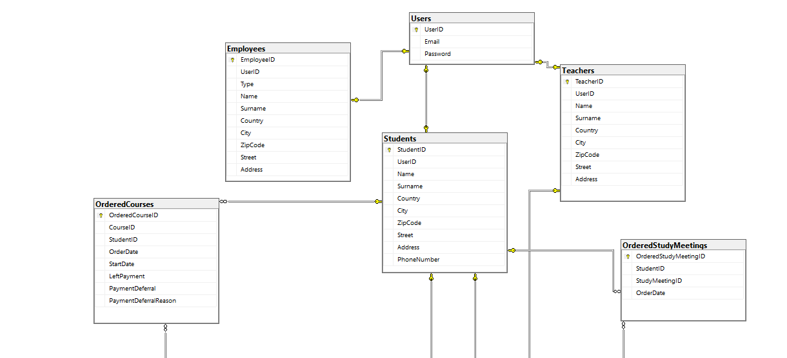
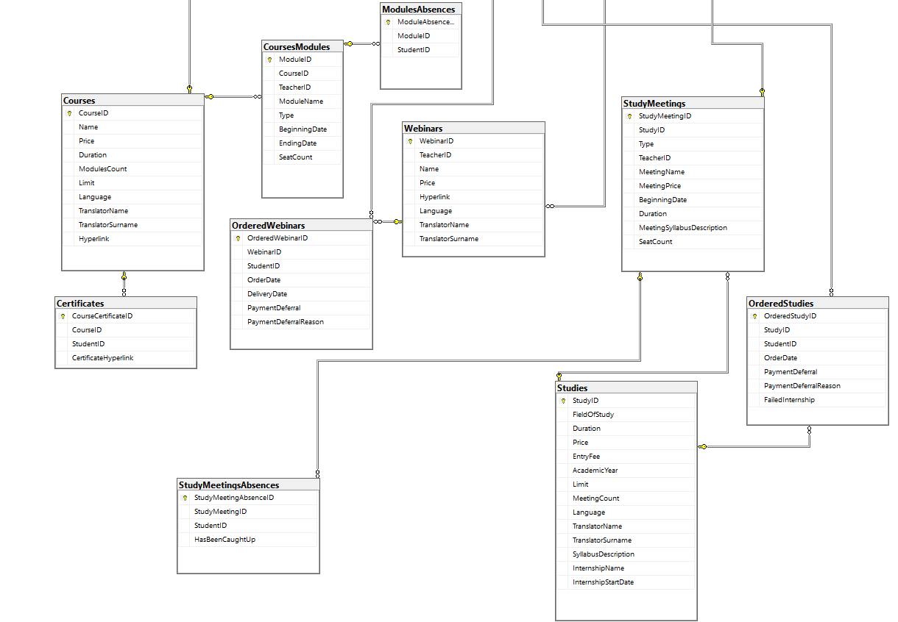

pbd_<14>_raport3 | Piotr Albiński, Adam Konior, Mateusz Maciaszczyk

## Identyfikacja użytkowników:
- pracownik biura obsługi dydaktyki:
  - wprowadzenie informacji o użytkownikach, pracownikach dodawanie i usuwanie użytkowników z systemu,
  - zarządzanie danymi np. usuwanie dostępu do webinarów, ustalenia cen produktów,
  - wprowadzanie harmonogramów (również ich zmiana),
  - przypisywanie kursom/webinarium/studium wykładowców/nauczycieli,
  - odroczenie płatności (decyzją Dyrektora Szkoły),
  - generowanie raportów:
    - finansowych - zestawienie przychodów z różnych form nauczania,
    - listy dłużników,
    - ogólny raport dotyczący liczby zapisanych osób na przyszłe wydarzenia,
    - lista obecności,
    - lista osób z kolizjami w terminach zajęć,
    - bilokacji wszystkich nauczycieli, uczniów
  - dodawanie produktów do sklepu(całościowych webinarów/kursów/studium),
  - usuwanie produktów ze sklepu,
  - wprowadzanie sylabusa do systemu 
  - generowanie listy kursantów, którzy ukończyli kurs,
  - Funkcje do naprawy błędów/dokonywania zmian:
    - modyfikowanie listy uczestników danego kursu/studium/webinaru(np. dodawanie uczestników po rozpoczęciu webinaru, usuwanie uczestników, którzy zrezygnowali),
- Dyrektor:
  - decyduje o odroczeniu płatności 
  - weryfikuje ukończenie kursów/studium i podejmuje decyzję o wysłaniu dyplomów (np. generowanie listy absolwentów), 
  - generowanie listy kursantów, którzy ukończyli kurs,
- klient firmy/ student: 
  - zakładanie konta w systemie,
  - logowanie do konta w systemie,
  - wyświetlanie i zarządzanie profilem,
  - dodawanie produktów do koszyka,
  - opłacanie wybranych produktów (samą płatność stanowi zewnętrzny system, którego nie mamy implementować),
  - generowanie własnych kolizji w planie zajęć,
  - sprawdzenie własnego długu,
  - dostęp do informacji o poszczególnych webinarach:
    - język wykładu,
    - dane prowadzącego,
  - możliwość zapisania się do odrobienia zajęć,
  - weryfikacja postępu w kursie (obecność, zaliczenie obejrzenia materiału),
  - generowanie raportu własnej frekwencji,
  - ogólny raport dotyczący liczby zapisanych osób na przyszłe wydarzenia,
  - ogólny raport dotyczący frekwencji
  - raport bilokacji własnych zajęć
- nauczyciel
  - udostępnianie webinarów(dodawanie do bazy rekordów z linkami),
  - generowanie raportów:
    - lista obecności (na zajęciach, prowadzonych przez siebie),
    - bilokacji (raport bilokacji własnych uczniów),
    - dot. frekwencji (raporty frekwencji własnych zajęć),
    - dot. osób zapisanych na przyszłe wydarzenia (raporty na temat osób zapisanych na zajęcia prowadzone przez siebie),
  - wprowadzenia frekwencji do systemu,
- system:
  - generowanie linku do płatności,
  - informacja zwrotna o statusie transakcji i dodanie dostępu do produktu do konta,
  - automatycznie sprawdzenie obecności,
  - weryfikacja obejrzenia materiału,
  - weryfikowanie warunków ukończenia kursów/studium,
  - ustalenie limitu miejsc,
  - weryfikowanie przekroczenia limitu miejsc: kursy hybrydowe i stacjonarne.





Skrypty tworzenia tabel:
Tabela Certificates:
```sql
CREATE TABLE [dbo].[Certificates](
	[CourseCertificateID] [int] NOT NULL,
	[CourseID] [int] NOT NULL,
	[StudentID] [int] NOT NULL,
	[CertificateHyperlink] [nvarchar](100) NOT NULL,
 CONSTRAINT [PK_Certificates] PRIMARY KEY CLUSTERED 
(
	[CourseCertificateID] ASC
)WITH (PAD_INDEX = OFF, STATISTICS_NORECOMPUTE = OFF, IGNORE_DUP_KEY = OFF, ALLOW_ROW_LOCKS = ON, ALLOW_PAGE_LOCKS = ON, OPTIMIZE_FOR_SEQUENTIAL_KEY = OFF) ON [PRIMARY]
) ON [PRIMARY]
GO

ALTER TABLE [dbo].[Certificates]  WITH CHECK ADD  CONSTRAINT [FK_Certificates_Courses] FOREIGN KEY([CourseID])
REFERENCES [dbo].[Courses] ([CourseID])
GO

ALTER TABLE [dbo].[Certificates] CHECK CONSTRAINT [FK_Certificates_Courses]
GO
```
Tabela Courses:
```sql
CREATE TABLE [dbo].[Courses](
	[CourseID] [int] NOT NULL,
	[Name] [nvarchar](50) NOT NULL,
	[Price] [money] NOT NULL,
	[Duration] [int] NOT NULL,
	[MeetingCount] [int] NOT NULL,
	[Limit] [int] NOT NULL,
	[Language] [nvarchar](50) NOT NULL,
	[TranslatorName] [nvarchar](50) NULL,
	[TranslatorSurname] [nvarchar](50) NULL,
	[Hyperlink] [nvarchar](100) NOT NULL,
 CONSTRAINT [PK_Courses] PRIMARY KEY CLUSTERED 
(
	[CourseID] ASC
)WITH (PAD_INDEX = OFF, STATISTICS_NORECOMPUTE = OFF, IGNORE_DUP_KEY = OFF, ALLOW_ROW_LOCKS = ON, ALLOW_PAGE_LOCKS = ON, OPTIMIZE_FOR_SEQUENTIAL_KEY = OFF) ON [PRIMARY]
) ON [PRIMARY]
GO
```
Tabela CoursesModules:
```sql
CREATE TABLE [dbo].[CoursesModules](
	[ModuleID] [int] NOT NULL,
	[TeacherID] [int] NOT NULL,
	[CourseID] [int] NOT NULL,
	[ModuleName] [nvarchar](50) NOT NULL,
	[Type] [nvarchar](50) NOT NULL,
	[BeginningDate] [datetime] NOT NULL,
	[EndingDate] [datetime] NOT NULL,
	[SeatCount] [int] NULL,
 CONSTRAINT [PK_CoursesModules] PRIMARY KEY CLUSTERED 
(
	[ModuleID] ASC
)WITH (PAD_INDEX = OFF, STATISTICS_NORECOMPUTE = OFF, IGNORE_DUP_KEY = OFF, ALLOW_ROW_LOCKS = ON, ALLOW_PAGE_LOCKS = ON, OPTIMIZE_FOR_SEQUENTIAL_KEY = OFF) ON [PRIMARY]
) ON [PRIMARY]
GO

ALTER TABLE [dbo].[CoursesModules]  WITH CHECK ADD  CONSTRAINT [FK_CoursesModules_Courses] FOREIGN KEY([CourseID])
REFERENCES [dbo].[Courses] ([CourseID])
GO

ALTER TABLE [dbo].[CoursesModules] CHECK CONSTRAINT [FK_CoursesModules_Courses]
GO
```
Tabela Employees:
```sql
CREATE TABLE [dbo].[Employees](
	[EmployeeID] [int] IDENTITY(1,1) NOT NULL,
	[UserID] [int] NOT NULL,
	[Type] [nvarchar](50) NOT NULL,
	[Name] [nvarchar](50) NOT NULL,
	[Surname] [nvarchar](50) NOT NULL,
	[Country] [nvarchar](50) NOT NULL,
	[City] [nvarchar](50) NOT NULL,
	[ZipCode] [nvarchar](50) NULL,
	[Street] [nvarchar](50) NOT NULL,
	[Address] [nvarchar](50) NOT NULL,
 CONSTRAINT [PK_Employees] PRIMARY KEY CLUSTERED 
(
	[EmployeeID] ASC
)WITH (PAD_INDEX = OFF, STATISTICS_NORECOMPUTE = OFF, IGNORE_DUP_KEY = OFF, ALLOW_ROW_LOCKS = ON, ALLOW_PAGE_LOCKS = ON, OPTIMIZE_FOR_SEQUENTIAL_KEY = OFF) ON [PRIMARY]
) ON [PRIMARY]
GO

ALTER TABLE [dbo].[Employees]  WITH CHECK ADD  CONSTRAINT [FK_Employees_Users] FOREIGN KEY([UserID])
REFERENCES [dbo].[Users] ([UserID])
GO

ALTER TABLE [dbo].[Employees] CHECK CONSTRAINT [FK_Employees_Users]
GO
```
Tabela ModulesAbsences:
```sql
CREATE TABLE [dbo].[ModulesAbsences](
	[ModuleAbsenceID] [nchar](10) NOT NULL,
	[ModuleID] [int] NOT NULL,
	[StudentID] [int] NOT NULL,
 CONSTRAINT [PK_CourseAbsences] PRIMARY KEY CLUSTERED 
(
	[ModuleAbsenceID] ASC
)WITH (PAD_INDEX = OFF, STATISTICS_NORECOMPUTE = OFF, IGNORE_DUP_KEY = OFF, ALLOW_ROW_LOCKS = ON, ALLOW_PAGE_LOCKS = ON, OPTIMIZE_FOR_SEQUENTIAL_KEY = OFF) ON [PRIMARY]
) ON [PRIMARY]
GO

ALTER TABLE [dbo].[ModulesAbsences]  WITH CHECK ADD  CONSTRAINT [FK_ModulesAbsences_CoursesModules] FOREIGN KEY([ModuleID])
REFERENCES [dbo].[CoursesModules] ([ModuleID])
GO

ALTER TABLE [dbo].[ModulesAbsences] CHECK CONSTRAINT [FK_ModulesAbsences_CoursesModules]
GO
```
Tabela OrderedCourses:
```sql
CREATE TABLE [dbo].[OrderedCourses](
	[OrderedCourseID] [int] NOT NULL,
	[CourseID] [int] NOT NULL,
	[StudentID] [int] NOT NULL,
	[OrderDate] [datetime] NOT NULL,
	[StartDate] [datetime] NOT NULL,
	[LeftPayment] [money] NOT NULL,
	[PaymentDeferral] [bit] NOT NULL,
	[PaymentDeferralReason] [nvarchar](max) NULL,
 CONSTRAINT [PK_OrderedCourses] PRIMARY KEY CLUSTERED 
(
	[OrderedCourseID] ASC
)WITH (PAD_INDEX = OFF, STATISTICS_NORECOMPUTE = OFF, IGNORE_DUP_KEY = OFF, ALLOW_ROW_LOCKS = ON, ALLOW_PAGE_LOCKS = ON, OPTIMIZE_FOR_SEQUENTIAL_KEY = OFF) ON [PRIMARY]
) ON [PRIMARY] TEXTIMAGE_ON [PRIMARY]
GO

ALTER TABLE [dbo].[OrderedCourses]  WITH CHECK ADD  CONSTRAINT [FK_OrderedCourses_Courses] FOREIGN KEY([CourseID])
REFERENCES [dbo].[Courses] ([CourseID])
GO

ALTER TABLE [dbo].[OrderedCourses] CHECK CONSTRAINT [FK_OrderedCourses_Courses]
GO

ALTER TABLE [dbo].[OrderedCourses]  WITH CHECK ADD  CONSTRAINT [FK_OrderedCourses_Students] FOREIGN KEY([StudentID])
REFERENCES [dbo].[Students] ([StudentID])
GO

ALTER TABLE [dbo].[OrderedCourses] CHECK CONSTRAINT [FK_OrderedCourses_Students]
GO
```
Tabela OrderedStudies:
```sql
CREATE TABLE [dbo].[OrderedStudies](
	[OrderedStudyID] [int] NOT NULL,
	[StudyID] [int] NOT NULL,
	[StudentID] [int] NOT NULL,
	[OrderDate] [datetime] NOT NULL,
	[PaymentDeferral] [bit] NOT NULL,
	[PaymentDeferralReason] [nvarchar](max) NULL,
	[FailedInternship] [bit] NOT NULL,
 CONSTRAINT [PK_OrderedStudies] PRIMARY KEY CLUSTERED 
(
	[OrderedStudyID] ASC
)WITH (PAD_INDEX = OFF, STATISTICS_NORECOMPUTE = OFF, IGNORE_DUP_KEY = OFF, ALLOW_ROW_LOCKS = ON, ALLOW_PAGE_LOCKS = ON, OPTIMIZE_FOR_SEQUENTIAL_KEY = OFF) ON [PRIMARY]
) ON [PRIMARY] TEXTIMAGE_ON [PRIMARY]
GO

ALTER TABLE [dbo].[OrderedStudies]  WITH CHECK ADD  CONSTRAINT [FK_OrderedStudies_Students] FOREIGN KEY([StudentID])
REFERENCES [dbo].[Students] ([StudentID])
GO

ALTER TABLE [dbo].[OrderedStudies] CHECK CONSTRAINT [FK_OrderedStudies_Students]
GO

ALTER TABLE [dbo].[OrderedStudies]  WITH CHECK ADD  CONSTRAINT [FK_OrderedStudies_Studies] FOREIGN KEY([StudyID])
REFERENCES [dbo].[Studies] ([StudyID])
GO

ALTER TABLE [dbo].[OrderedStudies] CHECK CONSTRAINT [FK_OrderedStudies_Studies]
GO
```
Tabela OrderedStudyMeetings:
```sql
CREATE TABLE [dbo].[OrderedStudyMeetings](
	[OrderedStudyMeetingID] [int] NOT NULL,
	[StudentID] [int] NOT NULL,
	[StudyMeetingID] [int] NOT NULL,
	[OrderDate] [datetime] NOT NULL,
 CONSTRAINT [PK_OrderedStudyMeetings] PRIMARY KEY CLUSTERED 
(
	[OrderedStudyMeetingID] ASC
)WITH (PAD_INDEX = OFF, STATISTICS_NORECOMPUTE = OFF, IGNORE_DUP_KEY = OFF, ALLOW_ROW_LOCKS = ON, ALLOW_PAGE_LOCKS = ON, OPTIMIZE_FOR_SEQUENTIAL_KEY = OFF) ON [PRIMARY]
) ON [PRIMARY]
GO

ALTER TABLE [dbo].[OrderedStudyMeetings]  WITH CHECK ADD  CONSTRAINT [FK_OrderedStudyMeetings_Students] FOREIGN KEY([StudentID])
REFERENCES [dbo].[Students] ([StudentID])
GO

ALTER TABLE [dbo].[OrderedStudyMeetings] CHECK CONSTRAINT [FK_OrderedStudyMeetings_Students]
GO

ALTER TABLE [dbo].[OrderedStudyMeetings]  WITH CHECK ADD  CONSTRAINT [FK_OrderedStudyMeetings_StudyMeetings] FOREIGN KEY([StudyMeetingID])
REFERENCES [dbo].[StudyMeetings] ([StudyMeetingID])
GO

ALTER TABLE [dbo].[OrderedStudyMeetings] CHECK CONSTRAINT [FK_OrderedStudyMeetings_StudyMeetings]
GO
```
Tabela OrderedWebinars:
```sql
CREATE TABLE [dbo].[OrderedWebinars](
	[OrderedWebinarID] [int] IDENTITY(1,1) NOT NULL,
	[WebinarID] [int] NOT NULL,
	[StudentID] [int] NOT NULL,
	[OrderDate] [datetime] NOT NULL,
	[DeliveryDate] [datetime] NOT NULL,
	[PaymentDeferral] [bit] NOT NULL,
	[PaymentDeferralReason] [nvarchar](max) NULL,
 CONSTRAINT [PK_OrderedWebinars] PRIMARY KEY CLUSTERED 
(
	[OrderedWebinarID] ASC
)WITH (PAD_INDEX = OFF, STATISTICS_NORECOMPUTE = OFF, IGNORE_DUP_KEY = OFF, ALLOW_ROW_LOCKS = ON, ALLOW_PAGE_LOCKS = ON, OPTIMIZE_FOR_SEQUENTIAL_KEY = OFF) ON [PRIMARY]
) ON [PRIMARY] TEXTIMAGE_ON [PRIMARY]
GO

ALTER TABLE [dbo].[OrderedWebinars]  WITH CHECK ADD  CONSTRAINT [FK_OrderedWebinars_Students] FOREIGN KEY([StudentID])
REFERENCES [dbo].[Students] ([StudentID])
GO

ALTER TABLE [dbo].[OrderedWebinars] CHECK CONSTRAINT [FK_OrderedWebinars_Students]
GO

ALTER TABLE [dbo].[OrderedWebinars]  WITH CHECK ADD  CONSTRAINT [FK_OrderedWebinars_Webinars] FOREIGN KEY([WebinarID])
REFERENCES [dbo].[Webinars] ([WebinarID])
GO

ALTER TABLE [dbo].[OrderedWebinars] CHECK CONSTRAINT [FK_OrderedWebinars_Webinars]
GO
```
Tabela Students:
```sql
CREATE TABLE [dbo].[Students](
	[StudentID] [int] IDENTITY(1,1) NOT NULL,
	[UserID] [int] NOT NULL,
	[Name] [nvarchar](50) NULL,
	[Surname] [nvarchar](50) NULL,
	[Country] [nvarchar](50) NOT NULL,
	[City] [nvarchar](50) NOT NULL,
	[ZipCode] [nvarchar](50) NULL,
	[Street] [nvarchar](50) NOT NULL,
	[Address] [nvarchar](50) NOT NULL,
	[PhoneNumber] [nvarchar](50) NULL,
 CONSTRAINT [PK_Students] PRIMARY KEY CLUSTERED 
(
	[StudentID] ASC
)WITH (PAD_INDEX = OFF, STATISTICS_NORECOMPUTE = OFF, IGNORE_DUP_KEY = OFF, ALLOW_ROW_LOCKS = ON, ALLOW_PAGE_LOCKS = ON, OPTIMIZE_FOR_SEQUENTIAL_KEY = OFF) ON [PRIMARY]
) ON [PRIMARY]
GO

ALTER TABLE [dbo].[Students]  WITH CHECK ADD  CONSTRAINT [FK_Students_Users] FOREIGN KEY([UserID])
REFERENCES [dbo].[Users] ([UserID])
GO

ALTER TABLE [dbo].[Students] CHECK CONSTRAINT [FK_Students_Users]
GO
```
Tabela Studies:
```sql
CREATE TABLE [dbo].[Studies](
	[StudyID] [int] NOT NULL,
	[FieldOfStudy] [nvarchar](50) NOT NULL,
	[Duration] [int] NOT NULL,
	[Price] [money] NOT NULL,
	[EntryFee] [money] NOT NULL,
	[AcademicYear] [int] NOT NULL,
	[Limit] [int] NOT NULL,
	[MeetingCount] [int] NOT NULL,
	[Language] [nvarchar](50) NOT NULL,
	[TranslatorName] [nvarchar](50) NULL,
	[TranslatorSurname] [nchar](10) NULL,
	[SyllabusDescription] [nvarchar](max) NOT NULL,
	[InternshipName] [nvarchar](50) NOT NULL,
	[InternshipStartDate] [datetime] NOT NULL,
 CONSTRAINT [PK_Studies] PRIMARY KEY CLUSTERED 
(
	[StudyID] ASC
)WITH (PAD_INDEX = OFF, STATISTICS_NORECOMPUTE = OFF, IGNORE_DUP_KEY = OFF, ALLOW_ROW_LOCKS = ON, ALLOW_PAGE_LOCKS = ON, OPTIMIZE_FOR_SEQUENTIAL_KEY = OFF) ON [PRIMARY]
) ON [PRIMARY] TEXTIMAGE_ON [PRIMARY]
GO
```
Tabela StudyMeetings:
```sql
CREATE TABLE [dbo].[StudyMeetings](
	[StudyMeetingID] [int] IDENTITY(1,1) NOT NULL,
	[StudyID] [int] NOT NULL,
	[Type] [nvarchar](50) NOT NULL,
	[TeacherID] [int] NOT NULL,
	[MeetingName] [nvarchar](50) NOT NULL,
	[MeetingPrice] [money] NOT NULL,
	[BeginningDate] [datetime] NOT NULL,
	[Duration] [time](7) NULL,
	[MeetingSyllabusDescription] [nvarchar](1000) NOT NULL,
	[SeatCount] [int] NULL,
 CONSTRAINT [PK_StudyMeetings] PRIMARY KEY CLUSTERED 
(
	[StudyMeetingID] ASC
)WITH (PAD_INDEX = OFF, STATISTICS_NORECOMPUTE = OFF, IGNORE_DUP_KEY = OFF, ALLOW_ROW_LOCKS = ON, ALLOW_PAGE_LOCKS = ON, OPTIMIZE_FOR_SEQUENTIAL_KEY = OFF) ON [PRIMARY]
) ON [PRIMARY]
GO

ALTER TABLE [dbo].[StudyMeetings]  WITH CHECK ADD  CONSTRAINT [FK_StudyMeetings_Studies] FOREIGN KEY([StudyID])
REFERENCES [dbo].[Studies] ([StudyID])
GO

ALTER TABLE [dbo].[StudyMeetings] CHECK CONSTRAINT [FK_StudyMeetings_Studies]
GO
```
Tabela StudyMeetingsAbsences:
```sql
CREATE TABLE [dbo].[StudyMeetingsAbsences](
	[StudyMeetingAbsenceID] [int] NOT NULL,
	[StudyMeetingID] [int] NOT NULL,
	[StudentID] [int] NOT NULL,
	[HasBeenCaughtUp] [bit] NOT NULL,
 CONSTRAINT [PK_StudyMeetingsAbsences_1] PRIMARY KEY CLUSTERED 
(
	[StudyMeetingAbsenceID] ASC
)WITH (PAD_INDEX = OFF, STATISTICS_NORECOMPUTE = OFF, IGNORE_DUP_KEY = OFF, ALLOW_ROW_LOCKS = ON, ALLOW_PAGE_LOCKS = ON, OPTIMIZE_FOR_SEQUENTIAL_KEY = OFF) ON [PRIMARY]
) ON [PRIMARY]
GO

ALTER TABLE [dbo].[StudyMeetingsAbsences]  WITH CHECK ADD  CONSTRAINT [FK_StudyMeetingsAbsences_StudyMeetings1] FOREIGN KEY([StudyMeetingID])
REFERENCES [dbo].[StudyMeetings] ([StudyMeetingID])
GO

ALTER TABLE [dbo].[StudyMeetingsAbsences] CHECK CONSTRAINT [FK_StudyMeetingsAbsences_StudyMeetings1]
GO
```
Tabela Teachers:
```sql
CREATE TABLE [dbo].[Teachers](
	[TeacherID] [int] IDENTITY(1,1) NOT NULL,
	[UserID] [int] NOT NULL,
	[Name] [nvarchar](50) NOT NULL,
	[Surname] [nvarchar](50) NOT NULL,
	[Country] [nvarchar](50) NOT NULL,
	[City] [nvarchar](50) NOT NULL,
	[ZipCode] [nvarchar](50) NULL,
	[Street] [nvarchar](50) NOT NULL,
	[Address] [nvarchar](50) NOT NULL,
 CONSTRAINT [PK_Teachers] PRIMARY KEY CLUSTERED 
(
	[TeacherID] ASC
)WITH (PAD_INDEX = OFF, STATISTICS_NORECOMPUTE = OFF, IGNORE_DUP_KEY = OFF, ALLOW_ROW_LOCKS = ON, ALLOW_PAGE_LOCKS = ON, OPTIMIZE_FOR_SEQUENTIAL_KEY = OFF) ON [PRIMARY]
) ON [PRIMARY]
GO

ALTER TABLE [dbo].[Teachers]  WITH CHECK ADD  CONSTRAINT [FK_Teachers_Users] FOREIGN KEY([UserID])
REFERENCES [dbo].[Users] ([UserID])
GO

ALTER TABLE [dbo].[Teachers] CHECK CONSTRAINT [FK_Teachers_Users]
GO
```
Tabela Users:
```sql
CREATE TABLE [dbo].[Users](
	[UserID] [int] IDENTITY(1,1) NOT NULL,
	[Email] [nvarchar](320) NOT NULL,
	[Password] [nvarchar](50) NOT NULL,
 CONSTRAINT [PK_Users] PRIMARY KEY CLUSTERED 
(
	[UserID] ASC
)WITH (PAD_INDEX = OFF, STATISTICS_NORECOMPUTE = OFF, IGNORE_DUP_KEY = OFF, ALLOW_ROW_LOCKS = ON, ALLOW_PAGE_LOCKS = ON, OPTIMIZE_FOR_SEQUENTIAL_KEY = OFF) ON [PRIMARY]
) ON [PRIMARY]
GO
```
Tabela Webinars:
```sql
CREATE TABLE [dbo].[Webinars](
	[WebinarID] [int] NOT NULL,
	[TeacherID] [int] NOT NULL,
	[Name] [nvarchar](50) NOT NULL,
	[Price] [money] NOT NULL,
	[Hyperlink] [nvarchar](100) NOT NULL,
	[Language] [nvarchar](50) NOT NULL,
	[TranslatorName] [nvarchar](50) NULL,
	[TranslatorSurname] [nvarchar](50) NULL,
 CONSTRAINT [PK_Webinars] PRIMARY KEY CLUSTERED 
(
	[WebinarID] ASC
)WITH (PAD_INDEX = OFF, STATISTICS_NORECOMPUTE = OFF, IGNORE_DUP_KEY = OFF, ALLOW_ROW_LOCKS = ON, ALLOW_PAGE_LOCKS = ON, OPTIMIZE_FOR_SEQUENTIAL_KEY = OFF) ON [PRIMARY]
) ON [PRIMARY]
GO

ALTER TABLE [dbo].[Webinars]  WITH CHECK ADD  CONSTRAINT [FK_Webinars_Teachers] FOREIGN KEY([TeacherID])
REFERENCES [dbo].[Teachers] ([TeacherID])
GO

ALTER TABLE [dbo].[Webinars] CHECK CONSTRAINT [FK_Webinars_Teachers]
GO
```
Wstawiliśmy do bazy dane testowe za pomocą generatora Mockaroo. Większość tabel(poza Employees i Teachers) ma 7-15 rekordów. Oto przykładowe operacje insert, które wykonaliśmy: 

Do Courses:
```sql
insert into Courses (CourseID, Name, Price, Duration, MeetingCount, Limit, Language, TranslatorName, TranslatorSurname, Hyperlink) values (1, 'Andalax', 38.09, 14, 50, 144, 'Moldovan', 'Corrina', 'Carmont', 'https://cdbaby.com');
insert into Courses (CourseID, Name, Price, Duration, MeetingCount, Limit, Language, TranslatorName, TranslatorSurname, Hyperlink) values (2, 'Tampflex', 20.6, 9, 32, 107, 'Nepali', 'Hedy', 'Paddock', 'http://uol.com.br');
```
Do Students:
```sql
insert into Students (StudentID, UserID, Country, City, ZipCode, Street, Address, PhoneNumber) values (1, 1, 'China', 'Xingnong', null, 'Corscot', 'PO Box 32827', '147-766-9836');
insert into Students (StudentID, UserID, Country, City, ZipCode, Street, Address, PhoneNumber) values (2, 2, 'Netherlands', 'Enschede', '7514', 'Burning Wood', 'PO Box 54439', '347-181-7847');
```
Do StudyMeetingsAbsences:
```sql
insert into StudyMeetingsAbsences (StudyMeetingAbsenceID, StudyMeetingID, StudentID, HasBeenCaughtUp) values (1, 1, 1, 0);
insert into StudyMeetingsAbsences (StudyMeetingAbsenceID, StudyMeetingID, StudentID, HasBeenCaughtUp) values (2, 2, 2, 0);
```
Do OrderedWebinars:
```sql
insert into OrderedWebinars (OrderedWebinarID, WebinarID, StudentID, OrderDate, ExpireDate, PaymentDeferral, PaymentDeferralReason) values (1, 1, 1, '11/3/2023', '6/25/2023', 1, 'Vestibulum ante ipsum primis in faucibus orci luctus et ultrices posuere cubilia Curae; Mauris viverra diam vitae quam.');
insert into OrderedWebinars (OrderedWebinarID, WebinarID, StudentID, OrderDate, ExpireDate, PaymentDeferral, PaymentDeferralReason) values (2, 2, 2, '12/13/2022', '5/25/2023', 0, null);
```

Opisy tabel:

## Tabela Certificates:
- Zawiera certifykaty dostępne przez hiperlink przypisywane studentom po ukończeniu określonego kursu

## Tabela Courses:
- CourseID, Name, Price, Duration, ModulesCount to odpowiednio identyfikator kursu, nazwa kursu, cena kursu, czas trwania kursu, liczba modułów.
- Limit to maksymalna liczba uczestników, ponieważ kursy hybrydowe i stacjonarne mają właśnie limit miejsc. 
- Language to język, w którym prowadzony jest kurs.
- TranslatorName i TranslatorSurname to imię i nazwisko osoby na żywo tłumaczącej wykład na język polski.
- Hyperlink to link do kursu, jeśli jest on prowadzony online.
 
## Tabela CoursesModules:
- Zawiera identyfikator modułu, identyfikator kursu, identyfikator nauczyciela prowadzącego kurs, nazwę modułu, typ modułu, datę rozpoczęcia, datę zakończenia, limit miejsc, jeśli taki jest
- Type(typ modułu) mówi, czy dany moduł jest stacjonary, online asynchroniczny, itp.
- SeatCount to limit miejsc, jeśli kurs jest online, to SeatCount powinien być null.

## Tabela Employees:
- Identyfikator pracownika
- Identyfikator użytkownika
- Imię pracownika
- Nazwisko pracownika
- Kraj zamieszkania
- Miejscowość
- Kod pocztowy
- Ulica
- Adres

## Tabela Students:
- Tabela przechowuje informacje o studencie - jego numer identyfikacyjny, adres i numer telefonu
- StudentID
- UserID
- Name
- Surname
- Country
- City
- ZipCode
- Street
- PhoneNumber

## Tabela OrderedWebinars:
- Tabela przechowuje informacje o zamówionych Webinarach. Przechowywujemy w niej identyfikator zamówienia, identyfikator webinaru, identyfikator kupującego studenta, datę zakupu, informację o odroczeniu płatności (typ bit 0/1) oraz ewentualne uzasadnienienie.
- OrderedWebinarID
- WebinarID
- StudentID
- OrderDate
- PaymentDefferal
- PaymentDeferralReason

## Tabela OrderedStudyMeetings
- Tabela przechowuje zakupiony dostęp przez studentów na spotkania na studiach. Tabela zawiera identyfikator zamówienia, identyfikator studiów, identyfikator spotkania, datę zamówienia.
- OrderedStudyMeetingID
- StudentID
- StudyMeetingID
- OrderDate


## Tabela OrderedStudies
- Tabela przechowuje zakupione przez studentów studia. Tabela zawiera identyfikator zamówienia, identyfikator studiów, identyfikator studenta, datę zamówienia, informację o odroczeniu płatności (typ bit 0/1) oraz ewentualne uzasadnienienie, pole informujące o niezaliczeniu studiów
- OrderedStudyID
- StudyID
- StudentID
- OrderDate
- PaymentDeferral
- PaymentDeferralReason
- FailedInternship

## Tabela OrderedCourses 
- Tabela przechowuje informacje o złożonych zamówieniach kursów przez studentów. Tabela zawiera pola identyfikatora zamówienia kursu, identyfikator kursu, identyfikator studenta, datę zamówienia, datę rozpoczęcia kursu, ile danemu studentowi pozostało do zapłaty (po zapłaceniu zaliczki),  informację o odroczeniu płatności (typ bit 0/1) oraz ewentualne uzasadnienienie.
- OrderedCourseID
- CourseID
- StudentID
- OrderDate
- StartDate
- LeftPayment
- PaymentDeferral
- PaymentDeferralReason

## Tabela ModulesAbsences
- Tabela przechowuje nieobecności studentów na modułach. Tabela zawiera identyfikator absencji, identyfikator modułu, identyfikator studenta.
- ModuleAbsenceID
- ModuleID
- StudentID

## Tabela Webinars:
- WebinarID identyfikator webinaru
- TeacherID identyfikator nauczyciela prowadzącego webinar
- Name nazwa webinaru
- Price cena webinaru
- Hyperlink link do webinaru
- Language język, w którym jest prowadzony webinar
- TranslatorName, TranslatorSurname imię i nazwisko tłumacza

## Tabela Users:
- Userid identyfikator użytkownika
- Email, Password - email i hasło użytkownika

## Tabela Teachers:
- TeacherID - identyfikator nauczyciela
- Name, Surname - imię i nazwisko nauczyciela
- Country, City, ZipCode, Street, Address - dane kontaktowe

## Tabela StudyMeetings: 
- StudyMeetingID identyfikator zajęć
- Type typ zajęć(stacjonarne, online...)
- teacherID identyfikator nauczyciela prowadzącego zajęcia
- MeetingName nazwa spotkania
- MeetingPrice cena spotkania jeżeli chce je kupić ktoś kto nie jest zapisany na studia
- BeginingDate, EndingDate data i czas rozpoczęcia i zakończenia zajęć
- MeetingSyllabusDescription opis zajęć(syllabus)
- SeatCount ilość wolnych miejsc(kiedy ktoś z poza studiów chce kupić miejsce to wiemy ile ich jest)

## Tabela StudyMeetingsAbsence:
- StudyMeetingsAbsence identyfikator nieobecności
- StudyMeetingID identyfikator zajęć
- StudentID identyfikator studenta
- HasBeenCaughtUp czy ta nieobecność została nadrobiona

## Tabela Studies:
- StudyID identyfikator studiów
- FieldOfStudy nazwa studiów
- Duration czas trwania studiów(ilość semestrów)
- Price koszt studiow
- StudySyllabusID klucz obcy do tabeli ze studymeetings
- EntryFee opłata początkowa za studia
- AcademicYear rok zaczęcia studiów
- Limit limit  miejsc możliwych do przyjęcia studentów
- MeetingCount ilość wszystkich spotkań w ramach studiów
- Language język sudiów
- Translator czy jest tłumacz
- SyllabusDescription opis studiów
- InternshipName nazwa praktyk
- InternshipStartDate data rozpoczęcia praktyk
