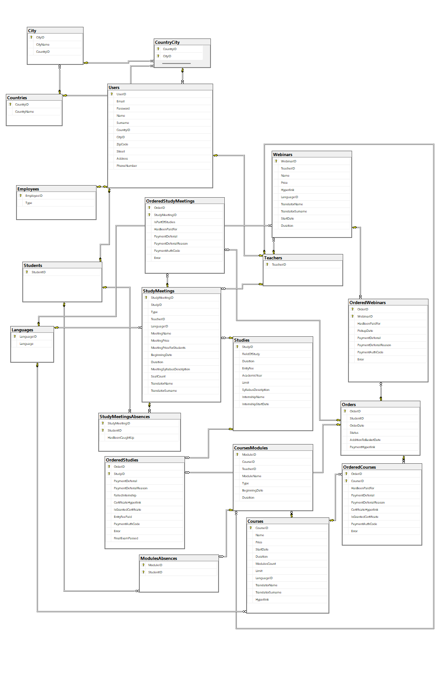
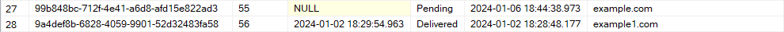
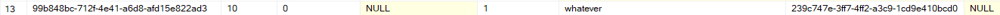
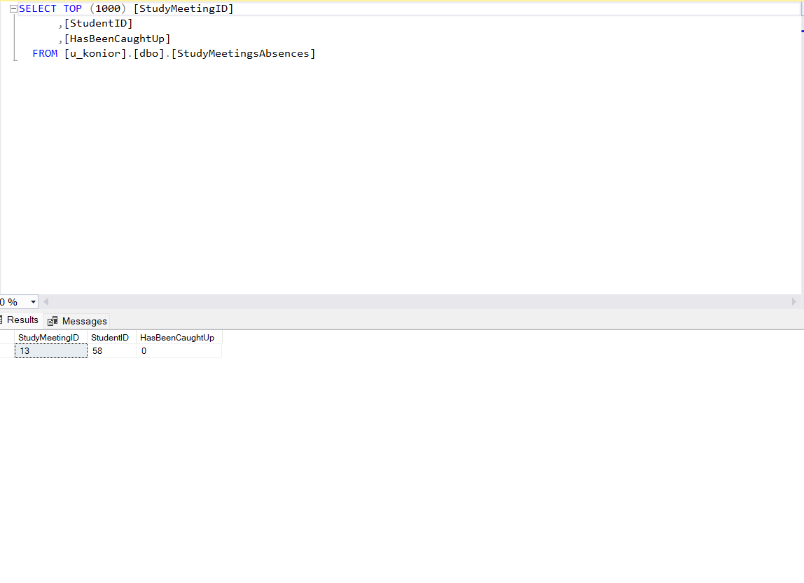

pbd_<14>_raport4 | Piotr Albiński, Adam Konior, Mateusz Maciaszczyk

## Identyfikacja użytkowników:
- pracownik biura obsługi dydaktyki:
  - wprowadzenie informacji o użytkownikach, pracownikach dodawanie i usuwanie użytkowników z systemu,
  - zarządzanie danymi np. usuwanie dostępu do webinarów, ustalenia cen produktów,
  - wprowadzanie harmonogramów (również ich zmiana),
  - przypisywanie kursom/webinarium/studium wykładowców/nauczycieli,
  - odroczenie płatności (decyzją Dyrektora Szkoły),
  - generowanie raportów:
    - finansowych - zestawienie przychodów z różnych form nauczania,
    - listy dłużników,
    - ogólny raport dotyczący liczby zapisanych osób na przyszłe wydarzenia,
    - lista obecności,
    - lista osób z kolizjami w terminach zajęć,
    - bilokacji wszystkich nauczycieli, uczniów
  - dodawanie produktów do sklepu(całościowych webinarów/kursów/studium),
  - usuwanie produktów ze sklepu,
  - wprowadzanie sylabusa do systemu 
  - generowanie listy kursantów, którzy ukończyli kurs,
  - Funkcje do naprawy błędów/dokonywania zmian:
    - modyfikowanie listy uczestników danego kursu/studium/webinaru(np. dodawanie uczestników po rozpoczęciu webinaru, usuwanie uczestników, którzy zrezygnowali),
- Dyrektor:
  - decyduje o odroczeniu płatności 
  - weryfikuje ukończenie kursów/studium i podejmuje decyzję o wysłaniu dyplomów (np. generowanie listy absolwentów), 
  - generowanie listy kursantów, którzy ukończyli kurs,
- klient firmy/ student: 
  - zakładanie konta w systemie,
  - logowanie do konta w systemie,
  - wyświetlanie i zarządzanie profilem,
  - dodawanie produktów do koszyka,
  - opłacanie wybranych produktów (samą płatność stanowi zewnętrzny system, którego nie mamy implementować),
  - generowanie własnych kolizji w planie zajęć,
  - sprawdzenie własnego długu,
  - dostęp do informacji o poszczególnych webinarach:
    - język wykładu,
    - dane prowadzącego,
  - możliwość zapisania się do odrobienia zajęć,
  - weryfikacja postępu w kursie (obecność, zaliczenie obejrzenia materiału),
  - generowanie raportu własnej frekwencji,
  - ogólny raport dotyczący liczby zapisanych osób na przyszłe wydarzenia,
  - ogólny raport dotyczący frekwencji
  - raport bilokacji własnych zajęć
- nauczyciel
  - udostępnianie webinarów(dodawanie do bazy rekordów z linkami),
  - generowanie raportów:
    - lista obecności (na zajęciach, prowadzonych przez siebie),
    - bilokacji (raport bilokacji własnych uczniów),
    - dot. frekwencji (raporty frekwencji własnych zajęć),
    - dot. osób zapisanych na przyszłe wydarzenia (raporty na temat osób zapisanych na zajęcia prowadzone przez siebie),
  - wprowadzenia frekwencji do systemu,
- system:
  - generowanie linku do płatności,
  - informacja zwrotna o statusie transakcji i dodanie dostępu do produktu do konta,
  - automatycznie sprawdzenie obecności,
  - weryfikacja obejrzenia materiału,
  - weryfikowanie warunków ukończenia kursów/studium,
  - ustalenie limitu miejsc,
  - weryfikowanie przekroczenia limitu miejsc: kursy hybrydowe i stacjonarne.




## Skrypty tworzenia tabel:

## Tabela City: 

- lista wszystkich miast

```sql
CREATE TABLE [dbo].[City](
	[CityID] [int] IDENTITY(1,1) NOT NULL,
	[CityName] [nvarchar](50) NOT NULL,
	[CountryID] [int] NOT NULL,
 CONSTRAINT [PK_City] PRIMARY KEY CLUSTERED 
(
	[CityID] ASC
)WITH (PAD_INDEX = OFF, STATISTICS_NORECOMPUTE = OFF, IGNORE_DUP_KEY = OFF, ALLOW_ROW_LOCKS = ON, ALLOW_PAGE_LOCKS = ON, OPTIMIZE_FOR_SEQUENTIAL_KEY = OFF) ON [PRIMARY]
) ON [PRIMARY]
GO

ALTER TABLE [dbo].[City]  WITH CHECK ADD  CONSTRAINT [FK_City_Countries] FOREIGN KEY([CountryID])
REFERENCES [dbo].[Countries] ([CountryID])
GO

ALTER TABLE [dbo].[City] CHECK CONSTRAINT [FK_City_Countries]
GO
```

## Tabela Countries:

- lista wszystkich państw

```sql
CREATE TABLE [dbo].[Countries](
	[CountryID] [int] IDENTITY(1,1) NOT NULL,
	[CountryName] [nchar](50) NOT NULL,
 CONSTRAINT [PK_Countries] PRIMARY KEY CLUSTERED 
(
	[CountryID] ASC
)WITH (PAD_INDEX = OFF, STATISTICS_NORECOMPUTE = OFF, IGNORE_DUP_KEY = OFF, ALLOW_ROW_LOCKS = ON, ALLOW_PAGE_LOCKS = ON, OPTIMIZE_FOR_SEQUENTIAL_KEY = OFF) ON [PRIMARY]
) ON [PRIMARY]
GO

ALTER TABLE [dbo].[Countries]  WITH CHECK ADD  CONSTRAINT [NotEmptyCountryName] CHECK  (([CountryName]<>''))
GO

ALTER TABLE [dbo].[Countries] CHECK CONSTRAINT [NotEmptyCountryName]
GO
```

## Tabela CountryCity:

- tabela która łączy kraje z miastami, używamy do walidacji czy dane miasto znajduje się w danym państwie

```sql
CREATE TABLE [dbo].[CountryCity](
	[CountryID] [int] NOT NULL,
	[CityID] [int] NOT NULL,
 CONSTRAINT [PK_CountryCity] PRIMARY KEY CLUSTERED 
(
	[CountryID] ASC,
	[CityID] ASC
)WITH (PAD_INDEX = OFF, STATISTICS_NORECOMPUTE = OFF, IGNORE_DUP_KEY = OFF, ALLOW_ROW_LOCKS = ON, ALLOW_PAGE_LOCKS = ON, OPTIMIZE_FOR_SEQUENTIAL_KEY = OFF) ON [PRIMARY]
) ON [PRIMARY]
GO

ALTER TABLE [dbo].[CountryCity]  WITH CHECK ADD  CONSTRAINT [FK_CountryCity_City] FOREIGN KEY([CityID])
REFERENCES [dbo].[City] ([CityID])
GO

ALTER TABLE [dbo].[CountryCity] CHECK CONSTRAINT [FK_CountryCity_City]
GO

ALTER TABLE [dbo].[CountryCity]  WITH CHECK ADD  CONSTRAINT [FK_CountryCity_Countries] FOREIGN KEY([CountryID])
REFERENCES [dbo].[Countries] ([CountryID])
GO

ALTER TABLE [dbo].[CountryCity] CHECK CONSTRAINT [FK_CountryCity_Countries]
GO
```

## Tabela Courses:

- tabela zawiera informacje na temat wszystkich kursów
- duration: czas trwania kursu
- modulesCount: liczba modułów, z których składa się kurs
- limit: ile osób może maksymalnie uczestniczyć w kursie

```sql
CREATE TABLE [dbo].[Courses](
	[CourseID] [int] IDENTITY(1,1) NOT NULL,
	[Name] [nvarchar](50) NOT NULL,
	[Price] [money] NOT NULL,
	[StartDate] [datetime] NOT NULL,
	[Duration] [int] NOT NULL,
	[ModulesCount] [int] NOT NULL,
	[Limit] [int] NOT NULL,
	[LanguageID] [int] NOT NULL,
	[TranslatorName] [nvarchar](50) NULL,
	[TranslatorSurname] [nvarchar](50) NULL,
	[Hyperlink] [nvarchar](100) NOT NULL,
 CONSTRAINT [PK_Courses] PRIMARY KEY CLUSTERED 
(
	[CourseID] ASC
)WITH (PAD_INDEX = OFF, STATISTICS_NORECOMPUTE = OFF, IGNORE_DUP_KEY = OFF, ALLOW_ROW_LOCKS = ON, ALLOW_PAGE_LOCKS = ON, OPTIMIZE_FOR_SEQUENTIAL_KEY = OFF) ON [PRIMARY]
) ON [PRIMARY]
GO

ALTER TABLE [dbo].[Courses]  WITH CHECK ADD  CONSTRAINT [FK_Courses_Languages] FOREIGN KEY([LanguageID])
REFERENCES [dbo].[Languages] ([LanguageID])
GO

ALTER TABLE [dbo].[Courses] CHECK CONSTRAINT [FK_Courses_Languages]
GO

ALTER TABLE [dbo].[Courses]  WITH CHECK ADD  CONSTRAINT [C_TranslatorName] CHECK  (([TranslatorName]<>'' AND [TranslatorSurname]<>''))
GO

ALTER TABLE [dbo].[Courses] CHECK CONSTRAINT [C_TranslatorName]
GO

ALTER TABLE [dbo].[Courses]  WITH CHECK ADD  CONSTRAINT [Duration] CHECK  (([Duration]>(0)))
GO

ALTER TABLE [dbo].[Courses] CHECK CONSTRAINT [Duration]
GO

ALTER TABLE [dbo].[Courses]  WITH CHECK ADD  CONSTRAINT [Limit] CHECK  (([Limit]>(0)))
GO

ALTER TABLE [dbo].[Courses] CHECK CONSTRAINT [Limit]
GO

ALTER TABLE [dbo].[Courses]  WITH CHECK ADD  CONSTRAINT [ModulesCount] CHECK  (([ModulesCount]>(0)))
GO

ALTER TABLE [dbo].[Courses] CHECK CONSTRAINT [ModulesCount]
GO

ALTER TABLE [dbo].[Courses]  WITH CHECK ADD  CONSTRAINT [Name] CHECK  (([Name]<>''))
GO

ALTER TABLE [dbo].[Courses] CHECK CONSTRAINT [Name]
GO

ALTER TABLE [dbo].[Courses]  WITH CHECK ADD  CONSTRAINT [Price] CHECK  (([Price]>(0)))
GO

ALTER TABLE [dbo].[Courses] CHECK CONSTRAINT [Price]
GO
```

## Tabela CoursesModules:

- tabela zawiera informacje na temat modułów, z których składa się kurs(courseID identyfikator kursu, w którym zawiera się dany moduł)
- type: typ modułu np. stacjonarne, online…
- BeginningDate, EndingDate: data rozpoczęcia i zakończenia kursu

```sql
CREATE TABLE [dbo].[CoursesModules](
	[ModuleID] [int] IDENTITY(1,1) NOT NULL,
	[CourseID] [int] NOT NULL,
	[TeacherID] [int] NOT NULL,
	[ModuleName] [nvarchar](50) NOT NULL,
	[Type] [nvarchar](50) NOT NULL,
	[BeginningDate] [datetime] NOT NULL,
	[Duration] [time](7) NOT NULL,
 CONSTRAINT [PK_CoursesModules] PRIMARY KEY CLUSTERED 
(
	[ModuleID] ASC
)WITH (PAD_INDEX = OFF, STATISTICS_NORECOMPUTE = OFF, IGNORE_DUP_KEY = OFF, ALLOW_ROW_LOCKS = ON, ALLOW_PAGE_LOCKS = ON, OPTIMIZE_FOR_SEQUENTIAL_KEY = OFF) ON [PRIMARY]
) ON [PRIMARY]
GO

ALTER TABLE [dbo].[CoursesModules]  WITH CHECK ADD  CONSTRAINT [FK_CoursesModules_Courses] FOREIGN KEY([CourseID])
REFERENCES [dbo].[Courses] ([CourseID])
GO

ALTER TABLE [dbo].[CoursesModules] CHECK CONSTRAINT [FK_CoursesModules_Courses]
GO

ALTER TABLE [dbo].[CoursesModules]  WITH CHECK ADD  CONSTRAINT [FK_CoursesModules_Teachers] FOREIGN KEY([TeacherID])
REFERENCES [dbo].[Teachers] ([TeacherID])
GO

ALTER TABLE [dbo].[CoursesModules] CHECK CONSTRAINT [FK_CoursesModules_Teachers]
GO

ALTER TABLE [dbo].[CoursesModules]  WITH CHECK ADD  CONSTRAINT [Type] CHECK  (([Type]='Online Asynchroniczny' OR [Type]='Online Synchroniczny' OR [Type]='Stacjonarny' OR [Type]='Hybrydowy'))
GO

ALTER TABLE [dbo].[CoursesModules] CHECK CONSTRAINT [Type]
GO
```

## Tabela Employees:

- tabela zawiera osoby, które są pracownikami
- type określa czy jest to pracownik biura czy dyrektor

```sql
CREATE TABLE [dbo].[Employees](
	[EmployeeID] [int] NOT NULL,
	[Type] [nvarchar](50) NOT NULL,
 CONSTRAINT [PK_Employees] PRIMARY KEY CLUSTERED 
(
	[EmployeeID] ASC
)WITH (PAD_INDEX = OFF, STATISTICS_NORECOMPUTE = OFF, IGNORE_DUP_KEY = OFF, ALLOW_ROW_LOCKS = ON, ALLOW_PAGE_LOCKS = ON, OPTIMIZE_FOR_SEQUENTIAL_KEY = OFF) ON [PRIMARY]
) ON [PRIMARY]
GO

ALTER TABLE [dbo].[Employees]  WITH CHECK ADD  CONSTRAINT [FK_Employees_Users] FOREIGN KEY([EmployeeID])
REFERENCES [dbo].[Users] ([UserID])
GO

ALTER TABLE [dbo].[Employees] CHECK CONSTRAINT [FK_Employees_Users]
GO

ALTER TABLE [dbo].[Employees]  WITH CHECK ADD  CONSTRAINT [E_Type] CHECK  (([Type]='Secretary' OR [Type]='Headmaster'))
GO

ALTER TABLE [dbo].[Employees] CHECK CONSTRAINT [E_Type]
GO
```

## Tabela Languages

- słownik języków
  
```sql
CREATE TABLE [dbo].[Languages](
	[LanguageID] [int] IDENTITY(1,1) NOT NULL,
	[Language] [nvarchar](50) NOT NULL,
 CONSTRAINT [PK_Languages] PRIMARY KEY CLUSTERED 
(
	[LanguageID] ASC
)WITH (PAD_INDEX = OFF, STATISTICS_NORECOMPUTE = OFF, IGNORE_DUP_KEY = OFF, ALLOW_ROW_LOCKS = ON, ALLOW_PAGE_LOCKS = ON, OPTIMIZE_FOR_SEQUENTIAL_KEY = OFF) ON [PRIMARY]
) ON [PRIMARY]
GO
```

## Tabela ModulesAbsences:

- tabela zawiera informacje, który student nie był na którym module z kursów

```sql
CREATE TABLE [dbo].[ModulesAbsences](
	[ModuleID] [int] NOT NULL,
	[StudentID] [int] NOT NULL,
 CONSTRAINT [PK_ModulesAbsences] PRIMARY KEY CLUSTERED 
(
	[ModuleID] ASC,
	[StudentID] ASC
)WITH (PAD_INDEX = OFF, STATISTICS_NORECOMPUTE = OFF, IGNORE_DUP_KEY = OFF, ALLOW_ROW_LOCKS = ON, ALLOW_PAGE_LOCKS = ON, OPTIMIZE_FOR_SEQUENTIAL_KEY = OFF) ON [PRIMARY]
) ON [PRIMARY]
GO

ALTER TABLE [dbo].[ModulesAbsences]  WITH CHECK ADD  CONSTRAINT [FK_ModulesAbsences_CoursesModules] FOREIGN KEY([ModuleID])
REFERENCES [dbo].[CoursesModules] ([ModuleID])
GO

ALTER TABLE [dbo].[ModulesAbsences] CHECK CONSTRAINT [FK_ModulesAbsences_CoursesModules]
GO

ALTER TABLE [dbo].[ModulesAbsences]  WITH CHECK ADD  CONSTRAINT [FK_ModulesAbsences_Students] FOREIGN KEY([StudentID])
REFERENCES [dbo].[Students] ([StudentID])
GO

ALTER TABLE [dbo].[ModulesAbsences] CHECK CONSTRAINT [FK_ModulesAbsences_Students]
GO
```

## Tabela OrderedCourses:

- tabela zawiera informacje na temat zamówionych kursów
- IsGrantedCertificate: czy został przyznany certyfikat
- CertificateHyperlink: link do certyfikatu

```sql
CREATE TABLE [dbo].[OrderedCourses](
	[OrderID] [nvarchar](50) NOT NULL,
	[CourseID] [int] NOT NULL,
	[HasBeenPaidFor] [bit] NOT NULL,
	[PaymentDeferral] [bit] NULL,
	[PaymentDeferralReason] [nvarchar](max) NULL,
	[CertificateHyperlink] [nvarchar](100) NULL,
	[IsGrantedCertificate] [bit] NULL,
	[PaymentAuthCode] [nvarchar](50) NULL,
	[Error] [nvarchar](max) NULL,
 CONSTRAINT [PK_OrderedCourses] PRIMARY KEY CLUSTERED 
(
	[OrderID] ASC,
	[CourseID] ASC
)WITH (PAD_INDEX = OFF, STATISTICS_NORECOMPUTE = OFF, IGNORE_DUP_KEY = OFF, ALLOW_ROW_LOCKS = ON, ALLOW_PAGE_LOCKS = ON, OPTIMIZE_FOR_SEQUENTIAL_KEY = OFF) ON [PRIMARY]
) ON [PRIMARY] TEXTIMAGE_ON [PRIMARY]
GO

ALTER TABLE [dbo].[OrderedCourses] ADD  CONSTRAINT [DF_OrderedCourses_IsGrantedCertificate]  DEFAULT ((0)) FOR [IsGrantedCertificate]
GO

ALTER TABLE [dbo].[OrderedCourses]  WITH CHECK ADD  CONSTRAINT [FK_OrderedCourses_Courses] FOREIGN KEY([CourseID])
REFERENCES [dbo].[Courses] ([CourseID])
GO

ALTER TABLE [dbo].[OrderedCourses] CHECK CONSTRAINT [FK_OrderedCourses_Courses]
GO

ALTER TABLE [dbo].[OrderedCourses]  WITH CHECK ADD  CONSTRAINT [FK_OrderedCourses_Orders] FOREIGN KEY([OrderID])
REFERENCES [dbo].[Orders] ([OrderID])
GO

ALTER TABLE [dbo].[OrderedCourses] CHECK CONSTRAINT [FK_OrderedCourses_Orders]
GO

ALTER TABLE [dbo].[OrderedCourses]  WITH CHECK ADD  CONSTRAINT [OC_Certificates] CHECK  (([IsGrantedCertificate]=(0) AND [CertificateHyperlink] IS NULL OR [CertificateHyperlink] IS NOT NULL))
GO

ALTER TABLE [dbo].[OrderedCourses] CHECK CONSTRAINT [OC_Certificates]
GO

ALTER TABLE [dbo].[OrderedCourses]  WITH CHECK ADD  CONSTRAINT [OC_PaymentDeferral] CHECK  (([PaymentDeferral]=(0) AND [PaymentDeferralReason] IS NULL OR [PaymentDeferral]=(1)))
GO

ALTER TABLE [dbo].[OrderedCourses] CHECK CONSTRAINT [OC_PaymentDeferral]
GO
```

## Tabela OrderedStudies:

- tabela zawiera informacje na temat zamówionych studiów
- FailedInternship: czy praktyki zostały zaliczone
- EntryFeePaid: czy opłata rekrutacyjna została opłacona

```sql
CREATE TABLE [dbo].[OrderedStudies](
	[OrderID] [nvarchar](50) NOT NULL,
	[StudyID] [int] NOT NULL,
	[PaymentDeferral] [bit] NULL,
	[PaymentDeferralReason] [nvarchar](max) NULL,
	[FailedInternship] [bit] NULL,
	[CertificateHyperlink] [nvarchar](100) NULL,
	[IsGrantedCertificate] [bit] NULL,
	[EntryFeePaid] [bit] NOT NULL,
	[PaymentAuthCode] [nvarchar](50) NULL,
	[Error] [nvarchar](max) NULL,
	[FinalExamPassed] [bit] NULL,
 CONSTRAINT [PK_OrderedStudies_1] PRIMARY KEY CLUSTERED 
(
	[OrderID] ASC,
	[StudyID] ASC
)WITH (PAD_INDEX = OFF, STATISTICS_NORECOMPUTE = OFF, IGNORE_DUP_KEY = OFF, ALLOW_ROW_LOCKS = ON, ALLOW_PAGE_LOCKS = ON, OPTIMIZE_FOR_SEQUENTIAL_KEY = OFF) ON [PRIMARY]
) ON [PRIMARY] TEXTIMAGE_ON [PRIMARY]
GO

ALTER TABLE [dbo].[OrderedStudies] ADD  CONSTRAINT [DF_OrderedStudies_IsGrantedCertificate]  DEFAULT ((0)) FOR [IsGrantedCertificate]
GO

ALTER TABLE [dbo].[OrderedStudies]  WITH CHECK ADD  CONSTRAINT [FK_OrderedStudies_Orders] FOREIGN KEY([OrderID])
REFERENCES [dbo].[Orders] ([OrderID])
GO

ALTER TABLE [dbo].[OrderedStudies] CHECK CONSTRAINT [FK_OrderedStudies_Orders]
GO

ALTER TABLE [dbo].[OrderedStudies]  WITH CHECK ADD  CONSTRAINT [FK_OrderedStudies_Studies] FOREIGN KEY([StudyID])
REFERENCES [dbo].[Studies] ([StudyID])
GO

ALTER TABLE [dbo].[OrderedStudies] CHECK CONSTRAINT [FK_OrderedStudies_Studies]
GO

ALTER TABLE [dbo].[OrderedStudies]  WITH CHECK ADD  CONSTRAINT [OS_Certificates] CHECK  (([IsGrantedCertificate]=(0) AND [CertificateHyperlink] IS NULL OR [CertificateHyperlink] IS NOT NULL OR [FailedInternship]=(0) AND [CertificateHyperlink] IS NULL))
GO

ALTER TABLE [dbo].[OrderedStudies] CHECK CONSTRAINT [OS_Certificates]
GO

ALTER TABLE [dbo].[OrderedStudies]  WITH CHECK ADD  CONSTRAINT [OS_PaymentDeferral] CHECK  (([PaymentDeferral]=(0) AND [PaymentDeferralReason] IS NULL OR [PaymentDeferral]=(1)))
GO

ALTER TABLE [dbo].[OrderedStudies] CHECK CONSTRAINT [OS_PaymentDeferral]
GO
```

## Tabela OrderedStudyMeetings:

- tabela zawiera informacje na temat zamówionych pojedynczych spotkań z toku studiów
- IsPartOfStudies: czy osoba która zamówiła spotkanie bierze udział w studiach
- LeftPayment: ile zostało do zapłacenia

```sql
CREATE TABLE [dbo].[OrderedStudyMeetings](
	[OrderID] [nvarchar](50) NOT NULL,
	[StudyMeetingID] [int] NOT NULL,
	[IsPartOfStudies] [bit] NOT NULL,
	[HasBeenPaidFor] [bit] NOT NULL,
	[PaymentDeferral] [bit] NULL,
	[PaymentDeferralReason] [nvarchar](max) NULL,
	[PaymentAuthCode] [nvarchar](50) NULL,
	[Error] [nvarchar](max) NULL,
 CONSTRAINT [PK_OrderedStudyMeetings_1] PRIMARY KEY CLUSTERED 
(
	[StudyMeetingID] ASC,
	[OrderID] ASC
)WITH (PAD_INDEX = OFF, STATISTICS_NORECOMPUTE = OFF, IGNORE_DUP_KEY = OFF, ALLOW_ROW_LOCKS = ON, ALLOW_PAGE_LOCKS = ON, OPTIMIZE_FOR_SEQUENTIAL_KEY = OFF) ON [PRIMARY]
) ON [PRIMARY] TEXTIMAGE_ON [PRIMARY]
GO

ALTER TABLE [dbo].[OrderedStudyMeetings]  WITH CHECK ADD  CONSTRAINT [FK_OrderedStudyMeetings_Orders] FOREIGN KEY([OrderID])
REFERENCES [dbo].[Orders] ([OrderID])
GO

ALTER TABLE [dbo].[OrderedStudyMeetings] CHECK CONSTRAINT [FK_OrderedStudyMeetings_Orders]
GO

ALTER TABLE [dbo].[OrderedStudyMeetings]  WITH CHECK ADD  CONSTRAINT [FK_OrderedStudyMeetings_StudyMeetings] FOREIGN KEY([StudyMeetingID])
REFERENCES [dbo].[StudyMeetings] ([StudyMeetingID])
GO

ALTER TABLE [dbo].[OrderedStudyMeetings] CHECK CONSTRAINT [FK_OrderedStudyMeetings_StudyMeetings]
GO

ALTER TABLE [dbo].[OrderedStudyMeetings]  WITH CHECK ADD  CONSTRAINT [OSM_PaymentDeferral] CHECK  (([PaymentDeferral]=(0) AND [PaymentDeferralReason] IS NULL OR [PaymentDeferral]=(1)))
GO

ALTER TABLE [dbo].[OrderedStudyMeetings] CHECK CONSTRAINT [OSM_PaymentDeferral]
GO
```

## Tabela OrderedWebinars:

- tabela zawiera informacje na temat zamówionych webinariów 
- OrderID: klucz obcy, który wskazuje na tabele Orders, do którego zamówienia należy dany webinar
- LeftPayment: ile zostało do zapłacenia
- PickupDate: okres, na który został zakupiony webinar
- PaymentDeferral, PaymentDeferralReasson: czy płatność została odroczona oraz powód

```sql
CREATE TABLE [dbo].[OrderedWebinars](
	[OrderID] [nvarchar](50) NOT NULL,
	[WebinarID] [int] NOT NULL,
	[HasBeenPaidFor] [bit] NOT NULL,
	[PickupDate] [datetime] NULL,
	[PaymentDeferral] [bit] NULL,
	[PaymentDeferralReason] [nvarchar](max) NULL,
	[PaymentAuthCode] [nvarchar](50) NULL,
	[Error] [nvarchar](max) NULL,
 CONSTRAINT [PK_OrderedWebinars] PRIMARY KEY CLUSTERED 
(
	[OrderID] ASC,
	[WebinarID] ASC
)WITH (PAD_INDEX = OFF, STATISTICS_NORECOMPUTE = OFF, IGNORE_DUP_KEY = OFF, ALLOW_ROW_LOCKS = ON, ALLOW_PAGE_LOCKS = ON, OPTIMIZE_FOR_SEQUENTIAL_KEY = OFF) ON [PRIMARY]
) ON [PRIMARY] TEXTIMAGE_ON [PRIMARY]
GO

ALTER TABLE [dbo].[OrderedWebinars]  WITH CHECK ADD  CONSTRAINT [FK_OrderedWebinars_Orders] FOREIGN KEY([OrderID])
REFERENCES [dbo].[Orders] ([OrderID])
GO

ALTER TABLE [dbo].[OrderedWebinars] CHECK CONSTRAINT [FK_OrderedWebinars_Orders]
GO

ALTER TABLE [dbo].[OrderedWebinars]  WITH CHECK ADD  CONSTRAINT [FK_OrderedWebinars_Webinars] FOREIGN KEY([WebinarID])
REFERENCES [dbo].[Webinars] ([WebinarID])
GO

ALTER TABLE [dbo].[OrderedWebinars] CHECK CONSTRAINT [FK_OrderedWebinars_Webinars]
GO

ALTER TABLE [dbo].[OrderedWebinars]  WITH CHECK ADD  CONSTRAINT [OW_PaymentDeferral] CHECK  (([PaymentDeferral]=(0) AND [PaymentDeferralReason] IS NULL OR [PaymentDeferral]=(1)))
GO

ALTER TABLE [dbo].[OrderedWebinars] CHECK CONSTRAINT [OW_PaymentDeferral]
GO
```

## Tabela Orders:

- tabela pełni rolę koszyka, zapisuje dane, który student co ma w koszyku oraz kiedy to zamówił
- status: informacja czy produkt jest w koszyku, czy płatność jest przetwarzana oraz czy produkt już jest zamówiony

```sql
CREATE TABLE [dbo].[Orders](
	[OrderID] [nvarchar](50) NOT NULL,
	[StudentID] [int] NOT NULL,
	[OrderDate] [datetime] NULL,
	[Status] [nvarchar](50) NOT NULL,
	[AdditionToBasketDate] [datetime] NULL,
	[PaymentHyperlink] [nvarchar](max) NULL,
 CONSTRAINT [PK_Orders] PRIMARY KEY CLUSTERED 
(
	[OrderID] ASC
)WITH (PAD_INDEX = OFF, STATISTICS_NORECOMPUTE = OFF, IGNORE_DUP_KEY = OFF, ALLOW_ROW_LOCKS = ON, ALLOW_PAGE_LOCKS = ON, OPTIMIZE_FOR_SEQUENTIAL_KEY = OFF) ON [PRIMARY]
) ON [PRIMARY] TEXTIMAGE_ON [PRIMARY]
GO

ALTER TABLE [dbo].[Orders]  WITH CHECK ADD  CONSTRAINT [O_Status] CHECK  (([Status]='Delivered' OR [Status]='Pending'))
GO

ALTER TABLE [dbo].[Orders] CHECK CONSTRAINT [O_Status]
GO
```

## Tabela Students:

- tabela zawiera wszystkie osoby, które są uczniami/wykupiły jakiś kurs/webinar

```sql
CREATE TABLE [dbo].[Students](
	[StudentID] [int] NOT NULL,
 CONSTRAINT [PK_Students] PRIMARY KEY CLUSTERED 
(
	[StudentID] ASC
)WITH (PAD_INDEX = OFF, STATISTICS_NORECOMPUTE = OFF, IGNORE_DUP_KEY = OFF, ALLOW_ROW_LOCKS = ON, ALLOW_PAGE_LOCKS = ON, OPTIMIZE_FOR_SEQUENTIAL_KEY = OFF) ON [PRIMARY]
) ON [PRIMARY]
GO

ALTER TABLE [dbo].[Students]  WITH CHECK ADD  CONSTRAINT [FK_Students_Users1] FOREIGN KEY([StudentID])
REFERENCES [dbo].[Users] ([UserID])
GO

ALTER TABLE [dbo].[Students] CHECK CONSTRAINT [FK_Students_Users1]
GO
```

## Tabela Studies:

- tabela zawiera informacje na temat wszystkich studiów
- duration: ile semestrów trwają studia
- entryFee: opłata rekrutacyjna
- SyllabusDescription: opis toku studiów 

```sql
CREATE TABLE [dbo].[Studies](
	[StudyID] [int] IDENTITY(1,1) NOT NULL,
	[FieldOfStudy] [nvarchar](50) NOT NULL,
	[Duration] [int] NOT NULL,
	[EntryFee] [money] NOT NULL,
	[AcademicYear] [int] NOT NULL,
	[Limit] [int] NOT NULL,
	[SyllabusDescription] [nvarchar](max) NOT NULL,
	[InternshipName] [nvarchar](50) NOT NULL,
	[InternshipStartDate] [datetime] NOT NULL,
 CONSTRAINT [PK_Studies] PRIMARY KEY CLUSTERED 
(
	[StudyID] ASC
)WITH (PAD_INDEX = OFF, STATISTICS_NORECOMPUTE = OFF, IGNORE_DUP_KEY = OFF, ALLOW_ROW_LOCKS = ON, ALLOW_PAGE_LOCKS = ON, OPTIMIZE_FOR_SEQUENTIAL_KEY = OFF) ON [PRIMARY],
 CONSTRAINT [FieldOfStudy] UNIQUE NONCLUSTERED 
(
	[FieldOfStudy] ASC
)WITH (PAD_INDEX = OFF, STATISTICS_NORECOMPUTE = OFF, IGNORE_DUP_KEY = OFF, ALLOW_ROW_LOCKS = ON, ALLOW_PAGE_LOCKS = ON, OPTIMIZE_FOR_SEQUENTIAL_KEY = OFF) ON [PRIMARY]
) ON [PRIMARY] TEXTIMAGE_ON [PRIMARY]
GO

ALTER TABLE [dbo].[Studies]  WITH CHECK ADD  CONSTRAINT [S_Duration] CHECK  (([Duration]>(0)))
GO

ALTER TABLE [dbo].[Studies] CHECK CONSTRAINT [S_Duration]
GO

ALTER TABLE [dbo].[Studies]  WITH CHECK ADD  CONSTRAINT [S_EntryFee] CHECK  (([EntryFee]>=(0)))
GO

ALTER TABLE [dbo].[Studies] CHECK CONSTRAINT [S_EntryFee]
GO

ALTER TABLE [dbo].[Studies]  WITH CHECK ADD  CONSTRAINT [S_Limit] CHECK  (([Limit]>(0)))
GO

ALTER TABLE [dbo].[Studies] CHECK CONSTRAINT [S_Limit]
GO

ALTER TABLE [dbo].[Studies]  WITH CHECK ADD  CONSTRAINT [S_NotEmpty] CHECK  (([SyllabusDescription]<>'' AND [InternshipName]<>''))
GO

ALTER TABLE [dbo].[Studies] CHECK CONSTRAINT [S_NotEmpty]
GO
```

## Tabela StudyMeetings:

- tabela zawiera informacje na temat wszystkich spotkań w ramach studiów
- type: typ spotkania np. stacjonarne, zdalne, hybrydowe
- MeetingPrice, MeetingPriceForStudents: cena za pojedyncze spotkanie dla osoby spoza studiów oraz dla osoby zapisanej już na studia

```sql
CREATE TABLE [dbo].[StudyMeetings](
	[StudyMeetingID] [int] IDENTITY(1,1) NOT NULL,
	[StudyID] [int] NOT NULL,
	[Type] [nvarchar](50) NOT NULL,
	[TeacherID] [int] NOT NULL,
	[LanguageID] [int] NULL,
	[MeetingName] [nvarchar](50) NOT NULL,
	[MeetingPrice] [money] NOT NULL,
	[MeetingPriceForStudents] [money] NOT NULL,
	[BeginningDate] [datetime] NOT NULL,
	[Duration] [time](7) NULL,
	[MeetingSyllabusDescription] [nvarchar](1000) NOT NULL,
	[SeatCount] [int] NULL,
	[TranslatorName] [nvarchar](50) NULL,
	[TranslatorSurname] [nvarchar](50) NULL,
 CONSTRAINT [PK_StudyMeetings] PRIMARY KEY CLUSTERED 
(
	[StudyMeetingID] ASC
)WITH (PAD_INDEX = OFF, STATISTICS_NORECOMPUTE = OFF, IGNORE_DUP_KEY = OFF, ALLOW_ROW_LOCKS = ON, ALLOW_PAGE_LOCKS = ON, OPTIMIZE_FOR_SEQUENTIAL_KEY = OFF) ON [PRIMARY]
) ON [PRIMARY]
GO

ALTER TABLE [dbo].[StudyMeetings]  WITH CHECK ADD  CONSTRAINT [FK_StudyMeetings_Languages] FOREIGN KEY([LanguageID])
REFERENCES [dbo].[Languages] ([LanguageID])
GO

ALTER TABLE [dbo].[StudyMeetings] CHECK CONSTRAINT [FK_StudyMeetings_Languages]
GO

ALTER TABLE [dbo].[StudyMeetings]  WITH CHECK ADD  CONSTRAINT [FK_StudyMeetings_Studies] FOREIGN KEY([StudyID])
REFERENCES [dbo].[Studies] ([StudyID])
GO

ALTER TABLE [dbo].[StudyMeetings] CHECK CONSTRAINT [FK_StudyMeetings_Studies]
GO

ALTER TABLE [dbo].[StudyMeetings]  WITH CHECK ADD  CONSTRAINT [FK_StudyMeetings_Teachers] FOREIGN KEY([TeacherID])
REFERENCES [dbo].[Teachers] ([TeacherID])
GO

ALTER TABLE [dbo].[StudyMeetings] CHECK CONSTRAINT [FK_StudyMeetings_Teachers]
GO

ALTER TABLE [dbo].[StudyMeetings]  WITH CHECK ADD  CONSTRAINT [SM_Duration] CHECK  (([Duration]='01:30' OR [Duration]='00:45'))
GO

ALTER TABLE [dbo].[StudyMeetings] CHECK CONSTRAINT [SM_Duration]
GO

ALTER TABLE [dbo].[StudyMeetings]  WITH CHECK ADD  CONSTRAINT [SM_MeetingPrice] CHECK  (([MeetingPrice]>(0) AND [MeetingPriceForStudents]>(0)))
GO

ALTER TABLE [dbo].[StudyMeetings] CHECK CONSTRAINT [SM_MeetingPrice]
GO

ALTER TABLE [dbo].[StudyMeetings]  WITH CHECK ADD  CONSTRAINT [SM_MeetingSyllabus] CHECK  (([MeetingSyllabusDescription]<>''))
GO

ALTER TABLE [dbo].[StudyMeetings] CHECK CONSTRAINT [SM_MeetingSyllabus]
GO

ALTER TABLE [dbo].[StudyMeetings]  WITH CHECK ADD  CONSTRAINT [SM_SeatCount] CHECK  (([SeatCount]>(0)))
GO

ALTER TABLE [dbo].[StudyMeetings] CHECK CONSTRAINT [SM_SeatCount]
GO
```

## Tabela StudyMeetingsAbsences:

- tabela zawiera informacje, który student nie był na którym spotkaniu ze studiów
- HasBeenCaughtUp: informacja czy odrobił tę nieobecność

```sql
CREATE TABLE [dbo].[StudyMeetingsAbsences](
	[StudyMeetingID] [int] NOT NULL,
	[StudentID] [int] NOT NULL,
	[HasBeenCaughtUp] [bit] NOT NULL,
 CONSTRAINT [PK_StudyMeetingsAbsences_1] PRIMARY KEY CLUSTERED 
(
	[StudyMeetingID] ASC,
	[StudentID] ASC
)WITH (PAD_INDEX = OFF, STATISTICS_NORECOMPUTE = OFF, IGNORE_DUP_KEY = OFF, ALLOW_ROW_LOCKS = ON, ALLOW_PAGE_LOCKS = ON, OPTIMIZE_FOR_SEQUENTIAL_KEY = OFF) ON [PRIMARY]
) ON [PRIMARY]
GO

ALTER TABLE [dbo].[StudyMeetingsAbsences]  WITH CHECK ADD  CONSTRAINT [FK_StudyMeetingsAbsences_Students] FOREIGN KEY([StudentID])
REFERENCES [dbo].[Students] ([StudentID])
GO

ALTER TABLE [dbo].[StudyMeetingsAbsences] CHECK CONSTRAINT [FK_StudyMeetingsAbsences_Students]
GO

ALTER TABLE [dbo].[StudyMeetingsAbsences]  WITH CHECK ADD  CONSTRAINT [FK_StudyMeetingsAbsences_StudyMeetings1] FOREIGN KEY([StudyMeetingID])
REFERENCES [dbo].[StudyMeetings] ([StudyMeetingID])
GO

ALTER TABLE [dbo].[StudyMeetingsAbsences] CHECK CONSTRAINT [FK_StudyMeetingsAbsences_StudyMeetings1]
GO
```

## Tabela Teachers:

- tabela zawiera wszystkie osoby, które są nauczycielami

```sql
CREATE TABLE [dbo].[Teachers](
	[TeacherID] [int] NOT NULL,
 CONSTRAINT [PK_Teachers] PRIMARY KEY CLUSTERED 
(
	[TeacherID] ASC
)WITH (PAD_INDEX = OFF, STATISTICS_NORECOMPUTE = OFF, IGNORE_DUP_KEY = OFF, ALLOW_ROW_LOCKS = ON, ALLOW_PAGE_LOCKS = ON, OPTIMIZE_FOR_SEQUENTIAL_KEY = OFF) ON [PRIMARY]
) ON [PRIMARY]
GO

ALTER TABLE [dbo].[Teachers]  WITH CHECK ADD  CONSTRAINT [FK_Teachers_Users1] FOREIGN KEY([TeacherID])
REFERENCES [dbo].[Users] ([UserID])
GO

ALTER TABLE [dbo].[Teachers] CHECK CONSTRAINT [FK_Teachers_Users1]
GO
```

## Tabela Users:

- tabela, w której znajdują się wszyscy użytkownicy i ich dane

```sql
CREATE TABLE [dbo].[Users](
	[UserID] [int] IDENTITY(1,1) NOT NULL,
	[Email] [nvarchar](320) NOT NULL,
	[Password] [nvarchar](50) NOT NULL,
	[Name] [nvarchar](50) NOT NULL,
	[Surname] [nvarchar](50) NOT NULL,
	[CountryID] [int] NOT NULL,
	[CityID] [int] NOT NULL,
	[ZipCode] [nvarchar](50) NULL,
	[Street] [nvarchar](50) NOT NULL,
	[Address] [nvarchar](50) NOT NULL,
	[PhoneNumber] [nvarchar](50) NULL,
 CONSTRAINT [PK_Users] PRIMARY KEY CLUSTERED 
(
	[UserID] ASC
)WITH (PAD_INDEX = OFF, STATISTICS_NORECOMPUTE = OFF, IGNORE_DUP_KEY = OFF, ALLOW_ROW_LOCKS = ON, ALLOW_PAGE_LOCKS = ON, OPTIMIZE_FOR_SEQUENTIAL_KEY = OFF) ON [PRIMARY]
) ON [PRIMARY]
GO

ALTER TABLE [dbo].[Users]  WITH CHECK ADD  CONSTRAINT [FK_Users_CountryCity] FOREIGN KEY([CountryID], [CityID])
REFERENCES [dbo].[CountryCity] ([CountryID], [CityID])
GO

ALTER TABLE [dbo].[Users] CHECK CONSTRAINT [FK_Users_CountryCity]
GO

ALTER TABLE [dbo].[Users]  WITH CHECK ADD  CONSTRAINT [U_Names] CHECK  (([Name]<>'' AND [Surname]<>''))
GO

ALTER TABLE [dbo].[Users] CHECK CONSTRAINT [U_Names]
GO

ALTER TABLE [dbo].[Users]  WITH CHECK ADD  CONSTRAINT [U_NotEmpty] CHECK  (([Email]<>'' AND [Password]<>'' AND [ZipCode]<>'' AND [Street]<>'' AND [Address]<>'' AND [PhoneNumber]<>''))
GO

ALTER TABLE [dbo].[Users] CHECK CONSTRAINT [U_NotEmpty]
GO
```

## Tabela Webinars:

- tabela zawiera informacje na temat wszystkich webinarów
- hyperlink: link do webinaru
- language: język, w którym są prowadzone webinary
- translatorName, translatorSurname: imię i nazwisko translatora

```sql
CREATE TABLE [dbo].[Webinars](
	[WebinarID] [int] IDENTITY(1,1) NOT NULL,
	[TeacherID] [int] NOT NULL,
	[Name] [nvarchar](50) NOT NULL,
	[Price] [money] NOT NULL,
	[Hyperlink] [nvarchar](100) NOT NULL,
	[LanguageID] [int] NOT NULL,
	[TranslatorName] [nvarchar](50) NULL,
	[TranslatorSurname] [nvarchar](50) NULL,
	[StartDate] [datetime] NOT NULL,
	[Duration] [time](7) NOT NULL,
 CONSTRAINT [PK_Webinars] PRIMARY KEY CLUSTERED 
(
	[WebinarID] ASC
)WITH (PAD_INDEX = OFF, STATISTICS_NORECOMPUTE = OFF, IGNORE_DUP_KEY = OFF, ALLOW_ROW_LOCKS = ON, ALLOW_PAGE_LOCKS = ON, OPTIMIZE_FOR_SEQUENTIAL_KEY = OFF) ON [PRIMARY]
) ON [PRIMARY]
GO

ALTER TABLE [dbo].[Webinars]  WITH CHECK ADD  CONSTRAINT [FK_Webinars_Languages] FOREIGN KEY([LanguageID])
REFERENCES [dbo].[Languages] ([LanguageID])
GO

ALTER TABLE [dbo].[Webinars] CHECK CONSTRAINT [FK_Webinars_Languages]
GO

ALTER TABLE [dbo].[Webinars]  WITH CHECK ADD  CONSTRAINT [FK_Webinars_Teachers] FOREIGN KEY([TeacherID])
REFERENCES [dbo].[Teachers] ([TeacherID])
GO

ALTER TABLE [dbo].[Webinars] CHECK CONSTRAINT [FK_Webinars_Teachers]
GO

ALTER TABLE [dbo].[Webinars]  WITH CHECK ADD  CONSTRAINT [W_Hyperlink] CHECK  (([Hyperlink]<>''))
GO

ALTER TABLE [dbo].[Webinars] CHECK CONSTRAINT [W_Hyperlink]
GO

ALTER TABLE [dbo].[Webinars]  WITH CHECK ADD  CONSTRAINT [W_Name] CHECK  (([Name]<>''))
GO

ALTER TABLE [dbo].[Webinars] CHECK CONSTRAINT [W_Name]
GO

ALTER TABLE [dbo].[Webinars]  WITH CHECK ADD  CONSTRAINT [W_Price] CHECK  (([Price]>(0)))
GO

ALTER TABLE [dbo].[Webinars] CHECK CONSTRAINT [W_Price]
GO

ALTER TABLE [dbo].[Webinars]  WITH CHECK ADD  CONSTRAINT [W_Translator] CHECK  (([TranslatorName]<>'' AND [TranslatorSurname]<>''))
GO

ALTER TABLE [dbo].[Webinars] CHECK CONSTRAINT [W_Translator]
GO
```

## Widoki

## Raporty dłużników

Dłużnikiem jest osoba, która dany produkt zamówiła, nie spełnia odpowiednich dla danego typu nauki terminów płatności, nie ma odroczenia płatności.

## Raport dłużników Courses
```sql
CREATE VIEW [dbo].[n_RaportDłużnikówCourses]
AS
SELECT        dbo.Students.StudentID, dbo.OrderedCourses.HasBeenPaidFor, GETDATE() AS CurrentDate, dbo.Courses.StartDate
FROM            dbo.Courses INNER JOIN
                         dbo.OrderedCourses ON dbo.Courses.CourseID = dbo.OrderedCourses.CourseID INNER JOIN
                         dbo.Orders ON dbo.OrderedCourses.OrderID = dbo.Orders.OrderID INNER JOIN
                         dbo.Students ON dbo.Orders.StudentID = dbo.Students.StudentID
WHERE        (dbo.OrderedCourses.PaymentDeferral = 0) AND (DATEDIFF(day, GETDATE(), dbo.Courses.StartDate) <= 3) AND (dbo.Orders.Status = 'Delivered') AND (dbo.OrderedCourses.HasBeenPaidFor = 0)
```

## Raport dłużników Studies
```sql
CREATE VIEW [dbo].[n_RaportDłużnikówStudies]
AS
SELECT        dbo.Students.StudentID
FROM            dbo.OrderedStudies INNER JOIN
                         dbo.Studies ON dbo.OrderedStudies.StudyID = dbo.Studies.StudyID INNER JOIN
                         dbo.StudyMeetings ON dbo.Studies.StudyID = dbo.StudyMeetings.StudyID INNER JOIN
                         dbo.OrderedStudyMeetings ON dbo.StudyMeetings.StudyMeetingID = dbo.OrderedStudyMeetings.StudyMeetingID INNER JOIN
                         dbo.Orders ON dbo.OrderedStudies.OrderID = dbo.Orders.OrderID AND dbo.OrderedStudyMeetings.OrderID = dbo.Orders.OrderID INNER JOIN
                         dbo.Students ON dbo.Orders.StudentID = dbo.Students.StudentID
WHERE        (dbo.OrderedStudies.PaymentDeferral = 0) AND (dbo.OrderedStudies.EntryFeePaid = 0) AND (dbo.Orders.Status = 'Delivered') OR
                         (dbo.Orders.Status = 'Delivered') AND (dbo.OrderedStudyMeetings.IsPartOfStudies = 1) AND (dbo.OrderedStudyMeetings.PaymentDeferral = 0) AND (DATEDIFF(day, GETDATE(), dbo.StudyMeetings.BeginningDate) <= 3) AND 
                         (dbo.OrderedStudyMeetings.HasBeenPaidFor = 1)
```
## Raport dłużników StudyMeetings bez studium
```sql
CREATE VIEW [dbo].[n_RaportDłużnikówStudyMeetingsNieStudium]
AS
SELECT        dbo.Students.StudentID, dbo.OrderedStudyMeetings.HasBeenPaidFor
FROM            dbo.Orders INNER JOIN
                         dbo.OrderedStudyMeetings ON dbo.Orders.OrderID = dbo.OrderedStudyMeetings.OrderID INNER JOIN
                         dbo.Students ON dbo.Orders.StudentID = dbo.Students.StudentID INNER JOIN
                         dbo.StudyMeetings ON dbo.OrderedStudyMeetings.StudyMeetingID = dbo.StudyMeetings.StudyMeetingID
WHERE        (dbo.OrderedStudyMeetings.IsPartOfStudies = 0) AND (dbo.OrderedStudyMeetings.PaymentDeferral = 0) AND (DATEDIFF(day, GETDATE(), dbo.StudyMeetings.BeginningDate) <= 3) AND (dbo.Orders.Status = 'Delivered') AND 
                         (dbo.OrderedStudyMeetings.HasBeenPaidFor = 0)
```
## Raport dłużników Webinars
```sql
CREATE VIEW [dbo].[n_RaportDłużnikówWebinars]
AS
SELECT        dbo.Students.StudentID, dbo.OrderedWebinars.HasBeenPaidFor, GETDATE() AS CurrentDate, dbo.Webinars.StartDate, dbo.OrderedWebinars.PaymentDeferral
FROM            dbo.OrderedWebinars INNER JOIN
                         dbo.Orders ON dbo.OrderedWebinars.OrderID = dbo.Orders.OrderID INNER JOIN
                         dbo.Webinars ON dbo.OrderedWebinars.WebinarID = dbo.Webinars.WebinarID INNER JOIN
                         dbo.Students ON dbo.Orders.StudentID = dbo.Students.StudentID
WHERE        (dbo.Webinars.StartDate < GETDATE()) AND (dbo.OrderedWebinars.PaymentDeferral = 0) AND (dbo.Orders.Status = 'Delivered') AND (dbo.OrderedWebinars.HasBeenPaidFor = 0)
```
## Raporty zapisanych.
To, że ktoś jest zapisany na dany typ spotkania oznacza, że zamówił go i jego status to 'Delivered'.
## Raport zapisanych osób na CoursesModules
```sql
CREATE VIEW [dbo].[n_RaportDotyczącyLiczbyOsóbNaCoursesModules]
AS
SELECT        dbo.CoursesModules.Type, COUNT(dbo.OrderedCourses.CourseID) AS [Liczba osob], dbo.CoursesModules.ModuleName
FROM            dbo.Orders INNER JOIN
                         dbo.Students ON dbo.Orders.StudentID = dbo.Students.StudentID INNER JOIN
                         dbo.OrderedCourses ON dbo.Orders.OrderID = dbo.OrderedCourses.OrderID INNER JOIN
                         dbo.Courses ON dbo.OrderedCourses.CourseID = dbo.Courses.CourseID INNER JOIN
                         dbo.CoursesModules ON dbo.Courses.CourseID = dbo.CoursesModules.CourseID
WHERE        (dbo.CoursesModules.BeginningDate > GETDATE()) AND (dbo.Orders.Status = 'Delivered')
GROUP BY dbo.Students.StudentID, dbo.OrderedCourses.CourseID, dbo.CoursesModules.Type, dbo.CoursesModules.ModuleName
```
## Raport zapisanych osób na Meetings
```sql
CREATE VIEW [dbo].[n_RaportDotyczącyLiczbyOsóbNaMeetings]
AS
SELECT        dbo.StudyMeetings.MeetingName, dbo.StudyMeetings.Type, COUNT(dbo.OrderedStudyMeetings.StudyMeetingID) AS [Liczba osob]
FROM            dbo.OrderedStudyMeetings INNER JOIN
                         dbo.StudyMeetings ON dbo.OrderedStudyMeetings.StudyMeetingID = dbo.StudyMeetings.StudyMeetingID INNER JOIN
                         dbo.Orders ON dbo.OrderedStudyMeetings.OrderID = dbo.Orders.OrderID INNER JOIN
                         dbo.Students ON dbo.Orders.StudentID = dbo.Students.StudentID
WHERE        (dbo.StudyMeetings.BeginningDate > GETDATE()) AND (dbo.Orders.Status = 'Delivered')
GROUP BY dbo.OrderedStudyMeetings.StudyMeetingID, dbo.StudyMeetings.Type, dbo.StudyMeetings.MeetingName
```
## Raport zapisanych osób na Webinars
```sql
CREATE VIEW [dbo].[n_RaportDotyczącyLiczbyOsóbNaWebinars]
AS
SELECT        dbo.Webinars.Name, COUNT(dbo.OrderedWebinars.WebinarID) AS [Liczba osob], 'zdalnie' AS tryb
FROM            dbo.OrderedWebinars INNER JOIN
                         dbo.Orders ON dbo.OrderedWebinars.OrderID = dbo.Orders.OrderID INNER JOIN
                         dbo.Webinars ON dbo.OrderedWebinars.WebinarID = dbo.Webinars.WebinarID INNER JOIN
                         dbo.Students ON dbo.Orders.StudentID = dbo.Students.StudentID
WHERE        (dbo.Webinars.StartDate > GETDATE()) AND (dbo.Orders.Status = 'Delivered')
GROUP BY dbo.Webinars.Name, dbo.OrderedWebinars.WebinarID
```

## Raporty Finansowe
Raporty są tworzone w następujące sposób, patrzymy do odpowiadających tabel ordered. Następnie łącząc z tabelą odpowiadającą typowi nauczania, grupujemy po ID i podajemy kwoty.
Dodatkowo sprawdzamy czy produkt został już zamówiony (nie jest w koszyku) i został opłacony. 

## Raport finansowy Courses
```sql
CREATE VIEW [dbo].[n_RaportFinansowyCourses]
AS
WITH t1 AS (SELECT        dbo.Courses.CourseID, COUNT(*) * dbo.Courses.Price AS zarobionasuma
                           FROM            dbo.Orders INNER JOIN
                                                    dbo.OrderedCourses ON dbo.Orders.OrderID = dbo.OrderedCourses.OrderID RIGHT OUTER JOIN
                                                    dbo.Courses ON dbo.OrderedCourses.CourseID = dbo.Courses.CourseID
                           WHERE        (dbo.Orders.Status = 'Delivered') AND (dbo.OrderedCourses.HasBeenPaidFor = 1)
                           GROUP BY dbo.Courses.CourseID, dbo.Courses.Price)
    SELECT        Courses_1.CourseID, ISNULL(t1_1.zarobionasuma, 0) AS Expr1
     FROM            dbo.Courses AS Courses_1 LEFT OUTER JOIN
                              t1 AS t1_1 ON t1_1.CourseID = Courses_1.CourseID
```

## Raport finansowy Studies
```sql
CREATE VIEW [dbo].[n_RaportFinansowyStudies]
AS
WITH t1 AS (SELECT        dbo.StudyMeetings.StudyMeetingID, COUNT(*) * dbo.StudyMeetings.MeetingPrice AS zarobionasuma
                           FROM            dbo.Orders INNER JOIN
                                                    dbo.OrderedStudyMeetings ON dbo.Orders.OrderID = dbo.OrderedStudyMeetings.OrderID RIGHT OUTER JOIN
                                                    dbo.StudyMeetings ON dbo.OrderedStudyMeetings.StudyMeetingID = dbo.StudyMeetings.StudyMeetingID
                           WHERE        (dbo.Orders.Status = 'Delivered') AND (dbo.OrderedStudyMeetings.HasBeenPaidFor = 1) AND (dbo.OrderedStudyMeetings.IsPartOfStudies = 1)
                           GROUP BY dbo.StudyMeetings.StudyMeetingID, dbo.StudyMeetings.MeetingPrice), t2 AS
    (SELECT        StudyMeetings_1.StudyID AS idstudiow, StudyMeetings_1.StudyMeetingID AS idspotkania, ISNULL(t1_1.zarobionasuma, 0) AS zarobionasuma
      FROM            dbo.StudyMeetings AS StudyMeetings_1 LEFT OUTER JOIN
                                t1 AS t1_1 ON t1_1.StudyMeetingID = StudyMeetings_1.StudyMeetingID), t3 AS
    (SELECT        idstudiow, SUM(zarobionasuma) AS zarobionasuma
      FROM            t2 AS t2_1
      GROUP BY idstudiow), t4 AS
    (SELECT        dbo.OrderedStudies.StudyID AS idstudiow, COUNT(dbo.OrderedStudies.EntryFeePaid) AS liczbaoplacenfee
      FROM            dbo.OrderedStudies INNER JOIN
                                dbo.Orders AS Orders_1 ON dbo.OrderedStudies.OrderID = Orders_1.OrderID
      WHERE        (Orders_1.Status = 'Delivered') AND (dbo.OrderedStudies.EntryFeePaid = 1)
      GROUP BY dbo.OrderedStudies.StudyID), t5 AS
    (SELECT        dbo.Studies.StudyID, ISNULL(t4_1.liczbaoplacenfee * dbo.Studies.EntryFee, 0) AS zarobekzentryfee
      FROM            dbo.Studies LEFT OUTER JOIN
                                t4 AS t4_1 ON dbo.Studies.StudyID = t4_1.idstudiow)
    SELECT        t5_1.StudyID, t3_1.zarobionasuma + t5_1.zarobekzentryfee AS zarobekcały
     FROM            t5 AS t5_1 LEFT OUTER JOIN
                              t3 AS t3_1 ON t5_1.StudyID = t3_1.idstudiow
```

## Raport finansowy StudyMeetings poza studium
```sql
CREATE VIEW [dbo].[n_RaportFinansowyStudyMeetingsNoStudies]
AS
WITH t1 AS (SELECT        dbo.StudyMeetings.StudyMeetingID, COUNT(*) * dbo.StudyMeetings.MeetingPrice AS zarobionasuma
                           FROM            dbo.Orders INNER JOIN
                                                    dbo.OrderedStudyMeetings ON dbo.Orders.OrderID = dbo.OrderedStudyMeetings.OrderID RIGHT OUTER JOIN
                                                    dbo.StudyMeetings ON dbo.OrderedStudyMeetings.StudyMeetingID = dbo.StudyMeetings.StudyMeetingID
                           WHERE        (dbo.Orders.Status = 'Delivered') AND (dbo.OrderedStudyMeetings.HasBeenPaidFor = 1) AND (dbo.OrderedStudyMeetings.IsPartOfStudies = 0)
                           GROUP BY dbo.StudyMeetings.StudyMeetingID, dbo.StudyMeetings.MeetingPrice)
    SELECT        StudyMeetings_1.StudyMeetingID, ISNULL(t1_1.zarobionasuma, 0) AS Expr1
     FROM            dbo.StudyMeetings AS StudyMeetings_1 LEFT OUTER JOIN
                              t1 AS t1_1 ON t1_1.StudyMeetingID = StudyMeetings_1.StudyMeetingID
```
## Raport finansowy Webinars
```sql
CREATE VIEW [dbo].[n_RaportFinansowyWebinary]
AS
WITH t1 AS (SELECT        dbo.Webinars.WebinarID, COUNT(*) * dbo.Webinars.Price AS zarobionasuma
                           FROM            dbo.Orders INNER JOIN
                                                    dbo.OrderedWebinars ON dbo.Orders.OrderID = dbo.OrderedWebinars.OrderID RIGHT OUTER JOIN
                                                    dbo.Webinars ON dbo.OrderedWebinars.WebinarID = dbo.Webinars.WebinarID
                           WHERE        (dbo.Orders.Status = 'Delivered') AND (dbo.OrderedWebinars.HasBeenPaidFor = 1)
                           GROUP BY dbo.Webinars.WebinarID, dbo.Webinars.Price)
    SELECT        Webinars_1.WebinarID, ISNULL(t1_1.zarobionasuma, 0) AS Expr1
     FROM            dbo.Webinars AS Webinars_1 LEFT OUTER JOIN
                              t1 AS t1_1 ON t1_1.WebinarID = Webinars_1.WebinarID
```
## Raporty frekwencji
Raporty frekwencji powstają w taki sposób, że od osób zapisanych na dany typ spotkania odejmujemy liczbę osób nieobecnych.
## Raport frekwencji Meetings
```sql
CREATE VIEW [dbo].[n_RaportFrekwencjiMeetings]
AS
WITH t1 AS (SELECT        dbo.StudyMeetings.MeetingName, dbo.StudyMeetings.Type, COUNT(dbo.OrderedStudyMeetings.StudyMeetingID) AS [Liczba osob], dbo.StudyMeetings.StudyMeetingID
                           FROM            dbo.OrderedStudyMeetings INNER JOIN
                                                    dbo.StudyMeetings ON dbo.OrderedStudyMeetings.StudyMeetingID = dbo.StudyMeetings.StudyMeetingID INNER JOIN
                                                    dbo.Orders ON dbo.OrderedStudyMeetings.OrderID = dbo.Orders.OrderID INNER JOIN
                                                    dbo.Students ON dbo.Orders.StudentID = dbo.Students.StudentID
                           WHERE        (dbo.StudyMeetings.BeginningDate >= GETDATE()) AND (dbo.Orders.Status = 'Delivered')
                           GROUP BY dbo.OrderedStudyMeetings.StudyMeetingID, dbo.StudyMeetings.Type, dbo.StudyMeetings.MeetingName, dbo.StudyMeetings.StudyMeetingID), t2 AS
    (SELECT        StudyMeetingID, COUNT(StudentID) AS absencje
      FROM            dbo.StudyMeetingsAbsences
      GROUP BY StudyMeetingID)
    SELECT        t1_1.StudyMeetingID, t1_1.[Liczba osob] - t2_1.absencje AS liczbaobecnych
     FROM            t1 AS t1_1 INNER JOIN
                              t2 AS t2_1 ON t2_1.StudyMeetingID = t1_1.StudyMeetingID
```

## Raport frekwencji Modules
```sql

CREATE VIEW [dbo].[n_RaportFrekwencjiModules]
AS
WITH t1 AS (SELECT        dbo.CoursesModules.Type, COUNT(dbo.OrderedCourses.CourseID) AS [Liczba osob], dbo.CoursesModules.ModuleName, dbo.CoursesModules.ModuleID
                           FROM            dbo.Orders INNER JOIN
                                                    dbo.Students ON dbo.Orders.StudentID = dbo.Students.StudentID INNER JOIN
                                                    dbo.OrderedCourses ON dbo.Orders.OrderID = dbo.OrderedCourses.OrderID INNER JOIN
                                                    dbo.Courses ON dbo.OrderedCourses.CourseID = dbo.Courses.CourseID INNER JOIN
                                                    dbo.CoursesModules ON dbo.Courses.CourseID = dbo.CoursesModules.CourseID
                           WHERE        (dbo.CoursesModules.BeginningDate >= GETDATE()) AND (dbo.Orders.Status = 'Delivered')
                           GROUP BY dbo.Students.StudentID, dbo.OrderedCourses.CourseID, dbo.CoursesModules.Type, dbo.CoursesModules.ModuleName, dbo.CoursesModules.ModuleID), t2 AS
    (SELECT        ModuleID, COUNT(StudentID) AS absencje
      FROM            dbo.ModulesAbsences
      GROUP BY ModuleID)
    SELECT        t1_1.ModuleID, t1_1.[Liczba osob] - t2_1.absencje AS liczbaobecnych
     FROM            t1 AS t1_1 INNER JOIN
                              t2 AS t2_1 ON t2_1.ModuleID = t1_1.ModuleID
```
## Procedury

# AddCourseToBasket, AddStudyMeetingToBasket, AddStudyToBasket, AddWebinarToBasket

Procedura polega na dodaniu kursu do koszyka. Na poziomie bazy danych dodaje ona do tabeli Orders nowy rekord z zamówieniem, które znajduje się w koszyku. Tabela
OrderedCourses pełni tutaj rolę takiego Order Details(jednemu zamówieniu w tabeli
Orders może odpowiadać kilka produltów w tabelach OrderedCourses, OrderedStudies, OrderedStudyMeetings, OrderedWebinars). Połączone są one z tabelą Orders przez OrderID. Po dodaniu pierwszego produktu do koszyka, generowany jest link do płatności i wstawiany do tabeli Orders dla odpowiedniego zamówienia.
Walidacja przy dodawaniu produktu do koszyka(w tym wypadku kursu) polega na sprawdzeniu, czy nie został przekroczony limit uczestników, czy są jeszcze 3 dni przed rozpoczęciem kursu, czy dany student i dany kurs istnieją oraz przy tworzeniu koszyka, czy przypadkiem nie został on już stworzony. Podobnie działają poniższe procedury AddStudyMeetingToBasket, AddStudyToBasket, AddWebinarToBasket.


Na tym przykładowym zrzucie ekranu z tabeli Orders kolejne kolumny to:

- OrderID
- StudentID
- OrderDate
- Status
- AdditionToBasketDate
- PaymentHyperlink


A to zrzut ekranu z tabeli OrderedWebinars. Kolejne kolumny to:

- OrderID
- WebinarID
- HasBeenPaidFor
- PickupDate
- PaymentDeferral
- PaymentDeferralReason
- PaymentAuthCode
- Error

```sql
ALTER PROCEDURE [dbo].[AddCourseToBasket]
	@OrderID nvarchar(50), 
	@StudentID int,
	@CourseID int,
	@PaymentHyperlink nvarchar(MAX)
AS
BEGIN
	SET NOCOUNT ON;
	SET XACT_ABORT ON; -- !!!
	-- weryfikujemy, czy podany kurs i student istnieją
BEGIN TRY
	IF NOT EXISTS (SELECT 1 FROM Courses WHERE CourseID = @CourseID) OR 
		NOT EXISTS (select 1 from Students where StudentID=@StudentID)
		THROW 50002,'Nie istnieje Kurs albo Student o takim ID',1;
	-- weryfikujemy, czy zamówienie tego kursu nie spowodowałoby przekroczenia limitu uczestników danego kursu
	DECLARE @limit_exceeded bit = 0;
	DECLARE @max_limit int;
	SELECT @max_limit = Limit FROM Courses WHERE CourseID=@CourseID;

	IF (SELECT COUNT(*)
		FROM OrderedCourses
		WHERE CourseID = @CourseID) >= @max_limit
		SET @limit_exceeded = 1
    
	IF (@limit_exceeded=1)
		THROW 50001,'Limit uczestnikow przekroczony',1;
	DECLARE @date_ok bit; -- weryfikujemy, czy na pewno nadal można kupić kurs(u nas kurs można dodać do koszyka najpóźniej
	-- 3 dni przed jego rozpoczęciem, można opłacić go później, ale wtedy jest się dłużnikiem)
	SELECT @date_ok = CASE 
						WHEN DATEDIFF(second, GETDATE(), StartDate) > 259200 THEN 1 -- 259200s = 72h = 3 dni
						ELSE 0
						END
					FROM 
					Courses
					WHERE CourseID=@CourseID;

	IF (@date_ok=0)
	BEGIN
		THROW 50003,'Za późno na kupienie tego kursu',1;
	END;

	DECLARE @order_exists bit = 0;
	SET @order_exists = dbo.DoesOrderExist(@OrderID);
	IF (@order_exists=0)
	BEGIN
		INSERT INTO Orders (OrderID, StudentID, Status, AdditionToBasketDate, PaymentHyperlink)
		VALUES (@OrderID, @StudentID, 'Pending', GETDATE(), @PaymentHyperlink);
	END
	INSERT INTO OrderedCourses (OrderID, CourseID, HasBeenPaidFor)
	VALUES (@OrderID, @CourseID, 0);
END TRY
BEGIN CATCH
	SELECT ERROR_NUMBER() as ErrorNumber,
			ERROR_MESSAGE() as ErrorMessage
END CATCH
END
```

```sql
ALTER PROCEDURE [dbo].[AddStudyMeetingToBasket]
	@OrderID nvarchar(50), 
	@StudentID int,
	@StudyMeetingID int,
	@isPartOfStudies bit,
	@PaymentHyperlink nvarchar(MAX)
AS
BEGIN
	SET NOCOUNT ON;
	SET XACT_ABORT ON
    -- Insert statements for procedure here
	-- sprawdzamy czy takie studium i taki student istnieją
BEGIN TRY
	IF (NOT EXISTS (select 1 from StudyMeetings where StudyMeetingID=@StudyMeetingID )) OR
		(NOT EXISTS (select 1 from Students where StudentID=@StudentID))
		THROW 50001,'Nie istnieje Zjazd albo Student o takim ID',1;

	DECLARE @limit_exceeded bit;
	DECLARE @max_limit int;
	SELECT @max_limit = SeatCount FROM StudyMeetings WHERE StudyMeetingID=@StudyMeetingID;
	
	IF (SELECT COUNT(*)
		FROM OrderedStudyMeetings
		WHERE StudyMeetingID = @StudyMeetingID) >= @max_limit
		SET @limit_exceeded = 1
	ELSE
		SET @limit_exceeded = 0
    
	IF (@limit_exceeded=1)
		THROW 50001,'Limit uczestnikow przekroczony',1;

	DECLARE @date_ok bit; -- weryfikujemy, czy na pewno nadal można kupić studium(trzeba dokonać wpłaty na 3 dni przed 
	-- rozpoczęciem)
	SELECT @date_ok = CASE 
						WHEN DATEDIFF(second, BeginningDate, GETDATE()) > 259200 THEN 1 -- 259200s = 72h = 3 dni
						ELSE 0
						END
					FROM 
					StudyMeetings
					WHERE StudyMeetingID=@StudyMeetingID;

	IF (@date_ok=0)
	BEGIN
		THROW 50001,'Za późno na kupienie tego kursu',1;
	END;
	
	-- sprawdzamy, czy koszyk już istnieje, jeśli nie, tworzymy go
	DECLARE @order_exists bit = 0;
	SET @order_exists = dbo.DoesOrderExist(@OrderID);
	IF (@order_exists=0)
	BEGIN
		INSERT INTO Orders (OrderID, StudentID, Status, AdditionToBasketDate, PaymentHyperlink)
		VALUES (@OrderID, @StudentID, 'Pending', GETDATE(), @PaymentHyperlink);
	END
	INSERT INTO OrderedStudyMeetings(OrderID, StudyMeetingID, HasBeenPaidFor, IsPartOfStudies)
	VALUES (@OrderID, @StudyMeetingID, 0, @isPartOfStudies);
END TRY
BEGIN CATCH
	SELECT ERROR_NUMBER() as ErrorNumber,
			ERROR_MESSAGE() as ErrorMessage
END CATCH
END
```

```sql
ALTER PROCEDURE [dbo].[AddStudyToBasket] 
	@OrderID nvarchar(50), 
	@StudentID int,
	@StudyID int,
	@PaymentHyperlink nvarchar(MAX)
AS
BEGIN
	SET NOCOUNT ON;
	SET XACT_ABORT ON
    -- Insert statements for procedure here
BEGIN TRY
	IF (NOT EXISTS (select 1 from Studies where StudyID=@StudyID)) OR
		(NOT EXISTS (select 1 from Students where StudentID=@StudentID))
		THROW 50001,'Nie istnieje Studium albo Student o takim ID',1;

	DECLARE @limit_exceeded bit;
	DECLARE @max_limit int;
	SELECT @max_limit = Limit FROM Studies WHERE StudyID=@StudyID;

	IF (SELECT COUNT(*)
		FROM OrderedStudies
		WHERE StudyID = @StudyID) >= @max_limit
		SET @limit_exceeded = 1
	ELSE
		SET @limit_exceeded = 0
    
	IF (@limit_exceeded=1)
		THROW 50001,'Limit uczestnikow przekroczony',1;

	-- sprawdzamy, czy takie studium i taki student istnieją
	DECLARE @order_exists bit = 0;
	SET @order_exists = dbo.DoesOrderExist(@OrderID);
	IF (@order_exists=0)
	BEGIN
		INSERT INTO Orders (OrderID, StudentID, Status, AdditionToBasketDate, PaymentHyperlink)
		VALUES (@OrderID, @StudentID, 'Pending', GETDATE(), @PaymentHyperlink);
	END
	INSERT INTO OrderedStudies (OrderID, StudyID, EntryFeePaid)
	VALUES (@OrderID, @StudyID, 0);
END TRY
BEGIN CATCH
	SELECT ERROR_NUMBER() as ErrorNumber,
			ERROR_MESSAGE() as ErrorMessage
END CATCH
END
```

```sql
ALTER PROCEDURE [dbo].[AddWebinarToBasket] 
	@WebinarID int, 
	@StudentID int,
	@OrderID nvarchar(50),
	@PaymentHyperlink nvarchar(MAX)
AS
BEGIN
	SET NOCOUNT ON;
	SET XACT_ABORT ON
    -- Insert statements for procedure here
	-- sprawdzamy, czy taki webinar i taki student istnieją
BEGIN TRY
	IF (EXISTS (select 1 from Webinars where WebinarID=@WebinarID)) AND 
		(EXISTS (select 1 from Students where StudentID=@StudentID))
	BEGIN
		DECLARE @order_exists bit = 0;
		SET @order_exists = dbo.DoesOrderExist(@OrderID);
		IF (@order_exists=0)
		BEGIN
			INSERT INTO Orders (OrderID, StudentID, Status, AdditionToBasketDate, PaymentHyperlink)
			VALUES (@OrderID, @StudentID, 'Pending', GETDATE(), @PaymentHyperlink);
		END
		INSERT INTO OrderedWebinars (OrderID, WebinarID, HasBeenPaidFor)
		VALUES (@OrderID, @WebinarID, 0);
	END
	ELSE
	BEGIN
		THROW 50001,'Nie istnieje Webinar albo Student o takim ID',1;
	END
END TRY
BEGIN CATCH
	SELECT ERROR_NUMBER() as ErrorNumber,
			ERROR_MESSAGE() as ErrorMessage
END CATCH
END
```
# DeliverTheOrder
Procedura polega na dostarczeniu zamówionych produktów znajdujących się uprzednio w koszyku. Osobna procedura niżej, "PayForProduct" rejestruje wpłatę za poszczególne produkty zamówienia. Dostarczenie produktu polega na zmianie statusu zamówienia z "Pending" (w koszyku) na "Delivered" (dostarczone) oraz ustawieniu daty zamówienia na obecną datę.

```sql
ALTER PROCEDURE [dbo].[DeliverTheOrder]
	@order_id nvarchar(50)
AS
BEGIN
	SET NOCOUNT ON;
	
    -- Insert statements for procedure here
	DECLARE @current_status nvarchar(50);
	SELECT @current_status = Status
								from Orders
								where OrderID=@order_id;
	IF (@current_status='Pending')
	BEGIN
		UPDATE Orders
		SET Status='Delivered', OrderDate=GETDATE()
		WHERE OrderID=@order_id;
		INSERT INTO OrderedStudyMeetings (OrderID, StudyMeetingID, IsPartOfStudies)
		(select OrderID, StudyMeetingID, 1 
				FROM Studies
				JOIN OrderedStudies on Studies.StudyID=OrderedStudies.StudyID
				JOIN StudyMeetings on Studies.StudyID = StudyMeetings.StudyID
				WHERE OrderID=@order_id);
	END;
	ELSE
	BEGIN
		RAISERROR ('Podane zamówienie zostało już dostarczone',16,1);
	END;
END
```

# PayForProduct
Procedura polega na zarejestrowaniu wpłaty za dany produkt. Ustawiany jest klucz autoryzacyjny płatności w razie wystąpienia błędu oraz pole w tabeli "Error" jest uzupełniane w razie wystąpienia błędu, który możemy przechwycić. Jeśli błąd nie wystąpił, powinniśmy przekazać NULL jako @error.

```sql
ALTER PROCEDURE [dbo].[PayForProduct]
	@product_type nvarchar(50),
	@product_id int,
	@student_id int,
	@payment_auth_code nvarchar(50),
	@error nvarchar(MAX)
AS
BEGIN
	SET NOCOUNT ON;

    -- Insert statements for procedure here
	-- Ta procedura jest wywoływana w momencie zatwierdzenia płatności przez naszą aplikację.
	
	IF (@product_type='webinar')
	BEGIN
		UPDATE OrderedWebinars
		SET HasBeenPaidFor=1, PaymentAuthCode=@payment_auth_code, Error=@error, PaymentDate=GETDATE()
		FROM OrderedWebinars
		JOIN Orders on OrderedWebinars.OrderID=Orders.OrderID
		WHERE WebinarID=@product_id and StudentID=@student_id;

	END;
	ELSE IF (@product_type='course')
	BEGIN
		UPDATE OrderedCourses
		SET HasBeenPaidFor=1, PaymentAuthCode=@payment_auth_code, Error=@error, PaymentDate=GETDATE()
		FROM OrderedCourses
		JOIN Orders on OrderedCourses.OrderID=Orders.OrderID
		WHERE CourseID=@product_id and StudentID=@student_id;

	END;
	ELSE IF (@product_type='study')
	BEGIN
		UPDATE OrderedStudies
		SET EntryFeePaid=1, PaymentAuthCode=@payment_auth_code, Error=@error,PaymentDate=GETDATE()
		FROM OrderedStudies
		JOIN Orders on OrderedStudies.OrderID=Orders.OrderID
		WHERE StudyID=@product_id and StudentID=@student_id;

	END;
	ELSE IF (@product_type='study_meeting')
	BEGIN
		UPDATE OrderedStudyMeetings
		SET HasBeenPaidFor=1, PaymentAuthCode=@payment_auth_code, Error=@error, PaymentDate=GETDATE()
		FROM OrderedStudyMeetings
		JOIN Orders on OrderedStudyMeetings.OrderID=Orders.OrderID
		WHERE StudyMeetingID=@product_id and StudentID=@student_id;

	END;
	ELSE
	BEGIN
		RAISERROR ('Podano bledny typ produktu',16,1);
	END
END
```

# RegisterCaughtUpStudyMeeting

Procedura polega na zarejestrowaniu odrobienia nieobecności na zjeździe(StudyMeeting) przez studenta.
Po prostu ustawia ona wartość w odpowiednim rekordzie kolumny HasBeenCaughtUp(czy została odrobiona) na True. Wtedy nie jest ona liczona jako nieobecność np. w raporcie frekwencji. Walidacja polega na sprawdzeniu, czy student faktycznie posiada nieobecność na tym zjeździe. Jeśli jej nie posiada, procedura zwraca błąd.

```sql
ALTER PROCEDURE [dbo].[RegisterCaughtUpStudyMeetingAbsence]
	-- Add the parameters for the stored procedure here
	@study_meeting_id int,
	@student_id int
AS
BEGIN
	-- SET NOCOUNT ON added to prevent extra result sets from
	-- interfering with SELECT statements.
	SET NOCOUNT ON;

    -- Insert statements for procedure here
	IF (exists (select 1 from StudyMeetingsAbsences where StudentID=@student_id and StudyMeetingID=@study_meeting_id))
		UPDATE StudyMeetingsAbsences 
		SET HasBeenCaughtUp=1 
		where StudentID=@student_id and StudyMeetingID=@study_meeting_id;
	ELSE
		RAISERROR ('Student nie zakupil tego zjazdu',16,1);
END
```

# ApplyPaymentDeferralToOrderedProduct

Przypisuje danemu produktowi z zamówienia odroczenie płatności(PaymentDeferral). Walidacja polega na sprawdzeniu, czy dany produkt nie został już przypadkiem opłacony - wtedy nie nadajemy odroczenia płatności.

```sql
ALTER PROCEDURE [dbo].[ApplyPaymentDeferralToOrderedProduct]
	@product_type nvarchar(50),
	@order_id nvarchar(50),
	@product_id int,
	@payment_deferral_reason nvarchar(MAX)
AS
BEGIN
	SET NOCOUNT ON;
	SET XACT_ABORT ON; -- !!
    -- Insert statements for procedure here
	BEGIN TRY
		IF (@product_type='webinar')
		BEGIN
			IF ((select HasBeenPaidFor from OrderedWebinars where OrderID=@order_id and WebinarID=@product_id)=0)
			BEGIN
				UPDATE OrderedWebinars
				SET PaymentDeferral=1, PaymentDeferralReason=@payment_deferral_reason
				WHERE OrderID=@order_id and WebinarID=@product_id;
			END
			ELSE
			BEGIN
				THROW 50001, 'Ten produkt zostal juz oplacony', 1;
			END
		END
		IF (@product_type='course')
		BEGIN
			IF ((select HasBeenPaidFor from OrderedCourses where OrderID=@order_id and CourseID=@product_id)=0)
			BEGIN
				UPDATE OrderedCourses
				SET PaymentDeferral=1, PaymentDeferralReason=@payment_deferral_reason
				WHERE OrderID=@order_id and CourseID=@product_id;
			END
			ELSE
			BEGIN
				THROW 50002, 'Ten produkt zostal juz oplacony', 1;
			END
		END
		IF (@product_type='study')
		BEGIN
			IF ((select EntryFeePaid from OrderedStudies where OrderID=@order_id and StudyID=@product_id)=0)
			BEGIN
				UPDATE OrderedStudies
				SET PaymentDeferral=1, PaymentDeferralReason=@payment_deferral_reason
				WHERE OrderID=@order_id and StudyID=@product_id;
			END
			ELSE
			BEGIN
				THROW 50003, 'Ten produkt zostal juz oplacony', 1;
			END
		END
		IF (@product_type='study_meeting')
		BEGIN
			IF ((select HasBeenPaidFor from OrderedStudyMeetings where OrderID=@order_id and StudyMeetingID=@product_id)=0)
			BEGIN
				UPDATE OrderedStudyMeetings
				SET PaymentDeferral=1, PaymentDeferralReason=@payment_deferral_reason
				WHERE OrderID=@order_id and StudyMeetingID=@product_id;
			END
			ELSE
			BEGIN
				THROW 50004, 'Ten produkt zostal juz oplacony', 1;
			END
		END
	END TRY
	BEGIN CATCH
		SELECT ERROR_NUMBER() as ErrorNumber,
			   ERROR_MESSAGE() as ErrorMessage
	END CATCH
END
```

# GrantStudentCertificate
Procedura polega na przyznaniu studentowi certyfikatu ukończenia studiów. Najpierw przechodzimy przez następujące walidacje:
- czy student w ogóle zamówił dane studium
- czy osiągnął 80% obecności
- czy zdał egzamin końcowy
- czy zaliczył praktyki
- czy dokonał wszelkich należności pieniężnych
Jeśli tak, wstawiamy do bazy podany link do certyfikatu dla tego studenta.

```sql
ALTER PROCEDURE [dbo].[GrantStudentCertificate]
	@student_id int,
	@certificate_hyperlink nvarchar(MAX),
	@study_id int
AS
BEGIN
	SET NOCOUNT ON;
	SET XACT_ABORT ON
    -- Insert statements for procedure here
	-- Najpierw sprawdzamy, czy student zamówił studium o takim @study_id
	DECLARE @ordered_study_exists bit;
	SELECT @ordered_study_exists = CASE
									WHEN count(StudyID) > 0 then 1
									else 0
								  END
									from OrderedStudies
									join Orders on Orders.OrderID=OrderedStudies.OrderID
									where Orders.StudentID=@student_id and OrderedStudies.StudyID=@study_id;
	-- Teraz liczymy ilość wszystkich spotkań i ilość niedrobionych absencji danego studenta na danym studium 
	DECLARE @total_study_meetings_count decimal;
	SELECT @total_study_meetings_count = count(StudyMeetingID) from StudyMeetings
										where StudyID=@study_id;
	DECLARE @absences_count decimal;
	SELECT @absences_count = count(StudyMeetingsAbsences.StudyMeetingID)
								from StudyMeetingsAbsences
								join StudyMeetings on StudyMeetings.StudyMeetingID = StudyMeetingsAbsences.StudyMeetingID
								where StudentID=@student_id and StudyID=@study_id and HasBeenCaughtUp=0;
	-- Sprawdzamy, czy student zdał egzamin końcowy z danego studium i czy zaliczył praktyki
	DECLARE @final_exam_passed bit;
	SELECT @final_exam_passed = FinalExamPassed
								from OrderedStudies
								join Orders on Orders.OrderID = OrderedStudies.OrderID
								where StudyID=@study_id and StudentID=@student_id; 
	DECLARE @failed_internship bit;
	SELECT @failed_internship = FailedInternship
								from OrderedStudies
								join Orders on Orders.OrderID = OrderedStudies.OrderID
								where StudyID=@study_id and StudentID=@student_id;
	-- Sprawdzamy dodatkowo, czy student opłacił wszelkie spotkania studyjne
	DECLARE @everything_paid bit;
	SELECT @everything_paid = CASE 
								WHEN COUNT(*) > 0 THEN 0
								ELSE 1
							  END
								from OrderedStudies
								join Orders on Orders.OrderID = OrderedStudies.OrderID
								join OrderedStudyMeetings on OrderedStudyMeetings.OrderID = Orders.OrderID
								where StudentID=@student_id and StudyID=@study_id and HasBeenPaidFor=0;
	-- Trzeba jeszcze sprawdzić, czy student uiścił wpisowe
	DECLARE @entry_fee_paid bit;
	SELECT @entry_fee_paid = CASE 
								WHEN EntryFeePaid=1 THEN 1
								ELSE 0
							  END
								from OrderedStudies
								join Orders on Orders.OrderID=OrderedStudies.OrderID
								where StudentID=@student_id and StudyID=@study_id;
	-- Ostateczna walidacja
	IF (@ordered_study_exists=1 and @total_study_meetings_count > 0 and @absences_count/@total_study_meetings_count<=0.2
		and @final_exam_passed=1 and @failed_internship=0 and @everything_paid=1 and @entry_fee_paid=1)
	BEGIN
		UPDATE OrderedStudies
		SET IsGrantedCertificate=1,
			CertificateHyperlink=@certificate_hyperlink
		FROM OrderedStudies
		join Orders on Orders.OrderID = OrderedStudies.OrderID
		where StudentID=@student_id and StudyID=@study_id;
	END;
	ELSE
	BEGIN
		RAISERROR ('Student nie spełnia kryteriów otrzymania certyfikatu z tego studium',16,1);
	END;
END
```

```sql
ALTER PROCEDURE [dbo].[InsertEmployees]
    @Email nvarchar(50),
    @Password nvarchar(50),
    @Name nvarchar(50),
    @Surname nvarchar(50),
    @Country nvarchar(50),
    @City nvarchar(50),
    @ZipCode nvarchar(50),
    @Street nvarchar(50),
    @Address nvarchar(50),
    @Phone nvarchar(50),
    @type nvarchar(50)
AS
BEGIN
    insert into Users(Email, Password, Name, Surname, CountryID, CityID, ZipCode, Street, Address, PhoneNumber)
    values (@Email, @Password, @Name, @Surname, (select CountryID from Countries where CountryName = @Country), (select CityID from City where CityName = @City), @ZipCode, @Street, @Address, @Phone);
    insert into Employees(EmployeeID, type) values ((select UserID from Users where Email = @Email), @type);
END
```

```sql
ALTER PROCEDURE [dbo].[InsertStudents]
    @Email nvarchar(50),
    @Password nvarchar(50),
    @Name nvarchar(50),
    @Surname nvarchar(50),
    @Country nvarchar(50),
    @City nvarchar(50),
    @ZipCode nvarchar(50),
    @Street nvarchar(50),
    @Address nvarchar(50),
    @Phone nvarchar(50)
AS
BEGIN
    insert into Users(Email, Password, Name, Surname, CountryID, CityID, ZipCode, Street, Address, PhoneNumber)
    values (@Email, @Password, @Name, @Surname, (select CountryID from Countries where CountryName = @Country), (select CityID from City where CityName = @City), @ZipCode, @Street, @Address, @Phone);
    insert into Students(StudentID) values ((select UserID from Users where Email = @Email));
END
```

```sql
ALTER PROCEDURE [dbo].[InsertTeachers]
    @Email nvarchar(50),
    @Password nvarchar(50),
    @Name nvarchar(50),
    @Surname nvarchar(50),
    @Country nvarchar(50),
    @City nvarchar(50),
    @ZipCode nvarchar(50),
    @Street nvarchar(50),
    @Address nvarchar(50),
    @Phone nvarchar(50)
AS
BEGIN
    insert into Users(Email, Password, Name, Surname, CountryID, CityID, ZipCode, Street, Address, PhoneNumber)
    values (@Email, @Password, @Name, @Surname, (select CountryID from Countries where CountryName = @Country), (select CityID from City where CityName = @City), @ZipCode, @Street, @Address, @Phone);
    insert into Teachers(TeacherID) values ((select UserID from Users where Email = @Email));
END
```

# RegisterModuleAbsence
Procedura polega na zarejestrowaniu nieobecności studenta na module poprzez dodanie rekordu do tabeli ModulesAbsences. Walidacja polega jedynie na sprawdzeniu, czy dany student w ogóle zamówił kurs z dnaym modułem.

```sql
ALTER PROCEDURE [dbo].[RegisterModuleAbsence]
	@module_id int,
	@student_id int
AS
BEGIN
	SET NOCOUNT ON;

    -- Insert statements for procedure here
	-- Sprawdzamy, czy dany student zamówił kurs z danym modułem
	IF (EXISTS (SELECT 1 FROM OrderedCourses
						JOIN Courses on Courses.CourseID=OrderedCourses.CourseID
						JOIN CoursesModules on Courses.CourseID=CoursesModules.CourseID
						JOIN Orders on Orders.OrderID = OrderedCourses.OrderID
						WHERE ModuleID=@module_id AND StudentID=@student_id))
	BEGIN
		INSERT INTO ModulesAbsences (ModuleID, StudentID)
		VALUES (@module_id, @student_id);
	END;
	ELSE
		RAISERROR ('Student nie posiada kursu z tym modulem',16,1);
END
```
# RegisterStudyMeetingAbsence

Procedura ma na celu zarejestrowanie nieobecności studenta na spotkaniu studyjnym.
Jeśli nieobecność nie zostanie zarejestrowana, to znaczy, że student był obecny.
Cała walidacja w procedurze opiera się na sprawdzeniu, czy dany student w ogóle 
zapisał się na dane spotkanie studyjne. Jeśli tak, nieobecność zostaje zarejestrowana.


```sql
ALTER PROCEDURE [dbo].[RegisterStudyMeetingAbsence]
	@student_id int,
	@study_meeting_id int
AS
BEGIN
	SET NOCOUNT ON;

    -- Insert statements for procedure here
	-- sprawdzamy, czy dany student zamowil w ogole dany zjazd
	IF (EXISTS (SELECT 1 FROM OrderedStudyMeetings
						JOIN Orders on Orders.OrderID = OrderedStudyMeetings.OrderID
						WHERE StudyMeetingID=@study_meeting_id AND StudentID=@student_id))
	BEGIN
		INSERT INTO StudyMeetingsAbsences (StudyMeetingID, StudentID, HasBeenCaughtUp)
		VALUES (@study_meeting_id, @student_id, 0);
	END
	ELSE
		RAISERROR ('Student nie zamowil tego zjazdu',16,1);
END
```

```sql
ALTER PROCEDURE [dbo].[InsertCourses]
    @Name NVARCHAR(50),
    @Price MONEY,
    @StartDate DATETIME,
    @Duration INT,
    @ModulesCount INT,
    @Limit INT,
    @Language NVARCHAR(50),
    @TranslatorName NVARCHAR(50),
    @TranslatorSurname NVARCHAR(50),
    @Hyperlink NVARCHAR(100)
AS
BEGIN
    -- sprawdzamy czy jezyk istnieje
    if not exists (select * from Languages where Language = @Language)
        begin
            raiserror('Język nie istnieje', 16, 1)
        end
    else
        begin
            -- sprawdzamy czy data jest wieksza od dzisiejszej
            if @StartDate <= GETDATE()
                begin
                    raiserror('Data startu musi byc po dniu dzisiajeszym', 16, 1)
                end
            else
                begin
                    insert into Courses (Name, Price, StartDate, Duration, ModulesCount, Limit, LanguageID, TranslatorName, TranslatorSurname, Hyperlink)
                    values (@Name, @Price, @StartDate, @Duration, @ModulesCount, @Limit, (select LanguageID from Languages where Language = @Language), @TranslatorName, @TranslatorSurname, @Hyperlink)
                end
        end
END
```

```sql
ALTER PROCEDURE [dbo].[InsertStudieMeetings]
    @Study nvarchar(50),
    @Type nvarchar(50),
    @TeacherID int,
    @Language nvarchar(50),
    @MeetingName nvarchar(50),
    @MeetingPrice money,
    @MeetingPriceForStudents money,
    @BeginningDate datetime,
    @Duration time,
    @Syllabus nvarchar(max),
    @Limit int,
    @TranslatorName nvarchar(50),
    @TranslatorSurname nvarchar(50)
AS
BEGIN
    if not exists (select * from Teachers where TeacherId = @TeacherID)
        begin
            raiserror('Nauczyciel nie istnieje', 16, 1)
        end
    else if not exists (select * from Languages where Language = @Language)
        begin
            raiserror('Język nie istnieje', 16, 1)
        end
    else if not exists (select * from Studies where FieldOfStudy = @Study)
        begin
            raiserror('Kierunek nie istnieje', 16, 1)
        end
    else if @BeginningDate <= getdate()
        begin
            raiserror('Data rozpoczęcia musi być późniejsza niż dzisiejsza', 16, 1)
        end
    else
        begin
            insert into StudyMeetings (StudyID, Type, TeacherID, LanguageID, MeetingName, MeetingPrice, MeetingPriceForStudents, BeginningDate, Duration, MeetingSyllabusDescription, SeatCount, TranslatorName, TranslatorSurname)
            values ((select StudyID from Studies where FieldOfStudy = @Study), @Type, @TeacherID, (select LanguageID from Languages where Languages.LanguageID = @Language), @MeetingName, @MeetingPrice, @MeetingPriceForStudents, @BeginningDate, @Duration, @Syllabus, @Limit, @TranslatorName, @TranslatorSurname)
        end
END
```

```sql
ALTER PROCEDURE [dbo].[InsertStudies]
    @FieldOfStudy nvarchar(50),
    @Duration int,
    @EntryFee money,
    @AcademicYear int,
    @Limit int,
    @Syllabus nvarchar(max),
    @InternshipName nvarchar(50),
    @InternshipStartDate datetime
AS
BEGIN
    if @AcademicYear >= YEAR(getdate())
        begin
            insert into Studies (FieldOfStudy, Duration, EntryFee, AcademicYear, Limit, SyllabusDescription, InternshipName, InternshipStartDate)
            values (@FieldOfStudy, @Duration, @EntryFee, @AcademicYear, @Limit, @Syllabus, @InternshipName, @InternshipStartDate)
        end
END
```

```sql
ALTER PROCEDURE [dbo].[InsertWebinars]
    @TeacherId INT,
    @Name NVARCHAR(50),
    @Price MONEY,
    @Hyperlink NVARCHAR(100),
    @Language NVARCHAR(50),
    @TranslatorName NVARCHAR(50),
    @TranslatorSurname NVARCHAR(50),
    @StartDate DATETIME,
    @Duration TIME
AS
BEGIN
    -- sprawdzamy czy nauczyciel istnieje
    if not exists (select * from Teachers where TeacherId = @TeacherId)
        begin
            raiserror('Nauczyciel nie istnieje', 16, 1)
        end
    else
        begin
            -- sprawdzamy czy jezyk istnieje
            if not exists (select * from Languages where Language = @Language)
                begin
                    raiserror('Język nie istnieje', 16, 1)
                end
            else
                begin
                    -- sprawdzamy czy data jest wieksza od dzisiejszej
                    if @StartDate <= GETDATE()
                        begin
                            raiserror('Data startu musi byc po dniu dzisiajeszym', 16, 1)
                        end
                    else
                        begin
                            insert into Webinars (TeacherId, Name, Price, Hyperlink, LanguageID, TranslatorName, TranslatorSurname, StartDate, Duration)
                            values (@TeacherId, @Name, @Price, @Hyperlink, (select LanguageID from Languages where Language = @Language), @TranslatorName, @TranslatorSurname, @StartDate, @Duration)
                        end
                end
        end
END
```

## Role:

# Teacher (nauczyciel)

- Rejestruje nieobecności studentów
- Rejestruje odrobienie nieobecności przez studenta

```sql
grant execute on RegisterStudyMeetingAbsence to Teacher
grant execute on RegisterModuleAbsence to Teacher
grant execute on RegisterCaughtUpStudyMeetingAbsence to Teacher
```